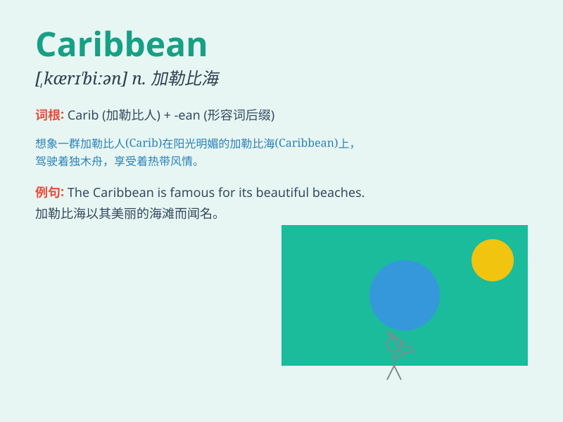

## Caribbean

**英音:** _[kəˈriː.bi.ən]_ **美音:** _[kærɪˈbiː.ən]_

**译义:** *adj. 加勒比海的；加勒比群岛的；居住在加勒比群岛的 n.
加勒比海地区；加勒比海居民*

### 短语

+ **Caribbean Sea:** _加勒比海_

+ **Caribbean Islands:** _加勒比群岛_

+ **Caribbean music:** _加勒比音乐_

+ **Caribbean cuisine:** _加勒比美食_

+ **Caribbean culture:** _加勒比文化_

### 例句

#### 例句1

> **The Caribbean is known for its beautiful beaches and clear
waters.**

**中文翻译:** 加勒比海以其美丽的海滩和清澈的海水而闻名。

**单词释义:** 加勒比海（地区）

#### 例句2

> **We went on a Caribbean cruise last year.**

**中文翻译:** 去年我们去坐了加勒比海游轮。

**单词释义:** 加勒比海（地区）

#### 例句3

> **The Caribbean music filled the air at the party.**

**中文翻译:** 派对上充满了加勒比音乐。

**单词释义:** 加勒比（地区的）

### 背诵小故事

> A group of friends decided to take a vacation. They chose the
Caribbean for its beautiful beaches and clear blue waters. They had a
wonderful time snorkeling and enjoying the tropical sun. Remember,
Caribbean means the area with amazing sea and fun.

**一群朋友决定去度假。他们选择了加勒比地区，因为那里有美丽的海滩和清澈的蓝色海水。他们度过了愉快的时光，进行了浮潜并享受了热带的阳光。记住，Caribbean
指的是有着迷人海景和欢乐的地区。**

### 图义

