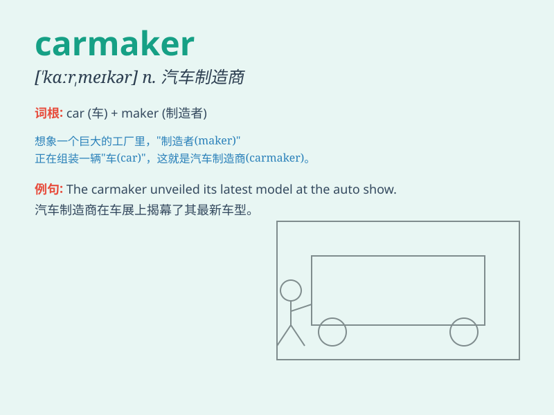

## carmaker

**英音:** _[\'kɑːmeɪkə(r)]_ **美音:** _[\'kɑːˌmeɪkə]_

**译义:** *n.汽车制造商*

### 短语

+ **leading carmaker:** _领先的汽车制造商_

+ **domestic carmaker:** _国内汽车制造商_

+ **emerging carmaker:** _新兴汽车制造商_

+ **global carmaker:** _全球汽车制造商_

+ **established carmaker:** _老牌汽车制造商_

### 例句

#### 例句1

> **The carmaker is launching a new model next year.**

**中文翻译:** 这家汽车制造商明年将推出一款新车型。

**单词释义:** 汽车制造商

#### 例句2

> **This carmaker is known for its high-quality vehicles.**

**中文翻译:** 这家汽车制造商因其高品质的车辆而闻名。

**单词释义:** 汽车制造商

#### 例句3

> **The leading carmaker has invested heavily in research and
development.**

**中文翻译:** 这家领先的汽车制造商在研发方面投入了大量资金。

**单词释义:** 汽车制造商

### 背诵小故事

> Once upon a time, there was a man named Tom. He had a big dream of
becoming a carmaker. He worked hard, learned skills, and finally made
his own wonderful cars. Tom\'s success made him a famous carmaker.

**从前，有个叫汤姆的人。他有个成为汽车制造商的大梦想。他努力工作，学习技能，最终制造出了自己的出色汽车。汤姆的成功让他成为了著名的汽车制造商。**

### 图义

