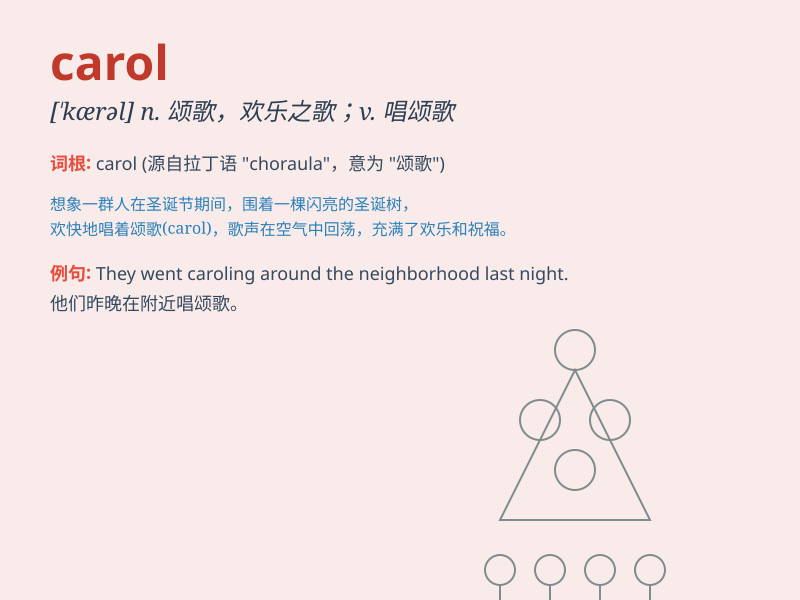

## carol

**英音:** _[\'kær(ə)l]_ **美音:** _[\'kærəl]_

**译义:** *n.欢乐的歌,颂歌,(尤指)圣诞节颂歌v.歌颂,欢唱 Carol
卡罗尔(女子名)*

### 短语

+ **Christmas carol:** _圣诞颂歌_

+ **carol singing:** _颂歌演唱_

+ **religious carol:** _宗教颂歌_

+ **carol service:** _颂歌仪式_

+ **sing carols:** _唱颂歌_

### 例句

#### 例句1

> **They caroled happily around the Christmas tree.**

**中文翻译:** 他们围着圣诞树快乐地唱着颂歌。

**单词释义:** 唱颂歌

#### 例句2

> **The choir caroled beautifully during the church service.**

**中文翻译:** 教堂礼拜期间，唱诗班唱出了美妙的颂歌。

**单词释义:** 欢唱；唱圣诞颂歌

#### 例句3

> **She caroled a folk song in a sweet voice.**

**中文翻译:** 她用甜美的声音唱着一首民歌。

**单词释义:** 唱歌

### 背诵小故事

> 圣诞节到了，小镇上的人们聚在一起欢乐地唱着 carol
。小明好奇地问妈妈这是什么意思，妈妈说：'carol
就是圣诞颂歌呀，大家用它来表达喜悦和祝福。'小明一下就记住了这个单词。

**圣诞节到了，小镇上的人们聚在一起欢乐地唱着圣诞颂歌。小明好奇地问妈妈这是什么意思，妈妈说：'carol
就是圣诞颂歌呀，大家用它来表达喜悦和祝福。'小明一下就记住了这个单词。**

### 图义

