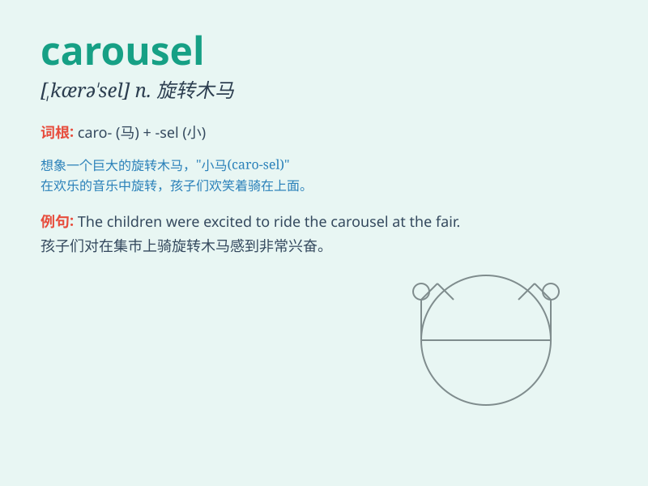

## carousel

**英音:** _[,kærə\'sel; -\'zel]_ **美音:**
_[\'kærə\'sɛl]_

**译义:** *n.喧闹的酒会*

### 短语

+ **carousel ride:** _旋转木马之旅_

+ **carousel conveyor:** _旋转式输送机_

+ **carousel system:** _旋转系统_

+ **carousel storage:** _旋转式存储_

+ **carousel machine:** _旋转式机器_

### 例句

#### 例句1

> **The carousel at the amusement park was filled with children
having fun.**

**中文翻译:** 游乐园里的旋转木马满是玩得开心的孩子。

**单词释义:** 旋转木马

#### 例句2

> **The baggage carousel in the airport was moving slowly.**

**中文翻译:** 机场的行李传送带移动得很慢。

**单词释义:** 行李传送带

#### 例句3

> **She chose a carousel horse painted in bright colors.**

**中文翻译:** 她选了一匹涂着鲜艳颜色的旋转木马的马。

**单词释义:** 旋转木马

### 背诵小故事

> A little girl went to the fair and was thrilled by the carousel. It
had beautiful horses going up and down. She couldn\'t forget the fun of
riding on the carousel.

**一个小女孩去了集市，被旋转木马吸引住了。它有漂亮的马上下移动。她忘不了乘坐旋转木马的乐趣。**

### 图义

