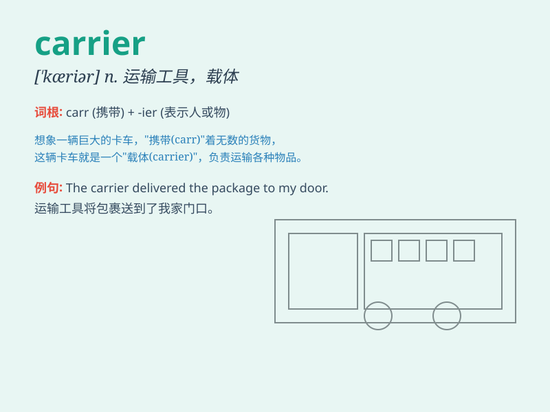

## carrier

**英音:** _[\'kærɪə]_ **美音:** _[\'kærɪɚ]_

**译义:**
*n.运送者,邮递员,带菌者,(自行车等)行李架,搬运器,航空母舰n.[电]载波(信号)*

### 短语

+ **carrier bag:** _购物袋；手提袋_

+ **carrier pigeon:** _信鸽_

+ **disease carrier:** _疾病携带者_

+ **aircraft carrier:** _航空母舰_

+ **heat carrier:** _热载体；载热体_

### 例句

#### 例句1

> **The mail carrier delivers letters and packages every day.**

**中文翻译:** 这位邮递员每天投递信件和包裹。

**单词释义:** 邮递员

#### 例句2

> **Aircraft carriers are large warships.**

**中文翻译:** 航空母舰是大型军舰。

**单词释义:** 航空母舰

#### 例句3

> **The virus carrier may not show any symptoms.**

**中文翻译:** 病毒携带者可能没有任何症状。

**单词释义:** 携带者

### 背诵小故事

> A carrier pigeon was chosen to carry an important message. It flew
through the sky, determined to reach its destination. The pigeon was a
reliable carrier, never failing its mission.

**一只信鸽被选中去携带一条重要的消息。它飞过天空，决心到达目的地。这只鸽子是个可靠的运输者，从未让任务失败。**

### 图义

