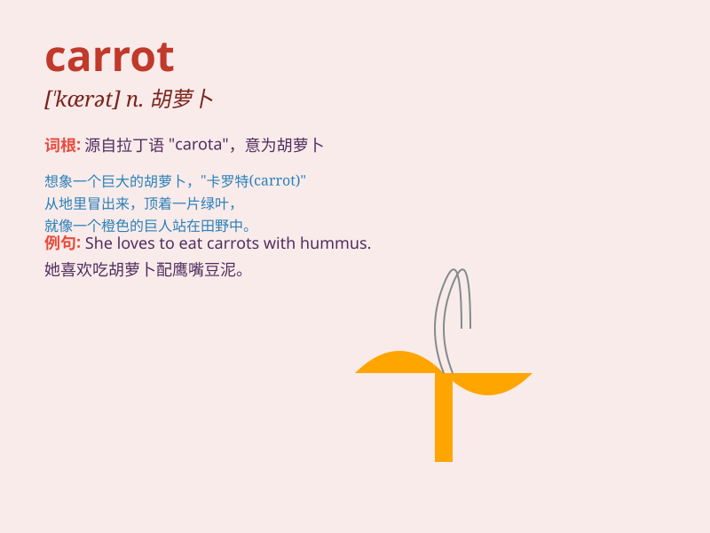

## carrot

**英音:** _[\'kærət]_ **美音:** _[\'kærət]_

**译义:** *n.胡萝卜*

### 短语

+ **carrot juice:** _胡萝卜汁_

+ **carrot cake:** _胡萝卜蛋糕_

+ **eat carrots:** _吃胡萝卜_

+ **grow carrots:** _种植胡萝卜_

+ **carrot sticks:** _胡萝卜条_

### 例句

#### 例句1

> **I like to eat carrots because they are good for my eyes.**

**中文翻译:** 我喜欢吃胡萝卜，因为它们对我的眼睛有好处。

**单词释义:** 胡萝卜（复数）

#### 例句2

> **The rabbit was chewing on a carrot.**

**中文翻译:** 兔子正在咀嚼一根胡萝卜。

**单词释义:** 胡萝卜（单数）

#### 例句3

> **She added some chopped carrots to the soup.**

**中文翻译:** 她往汤里加了一些切碎的胡萝卜。

**单词释义:** 胡萝卜（复数）

### 背诵小故事

> A hungry rabbit was looking for food in the garden. It found a big
carrot and was so happy. It bit the carrot and enjoyed the sweet taste.
The carrot became its favorite food.

**一只饥饿的兔子在花园里找食物。它发现了一根大胡萝卜，非常高兴。它咬了胡萝卜，享受着甜甜的味道。胡萝卜成了它最爱的食物。**

### 图义

