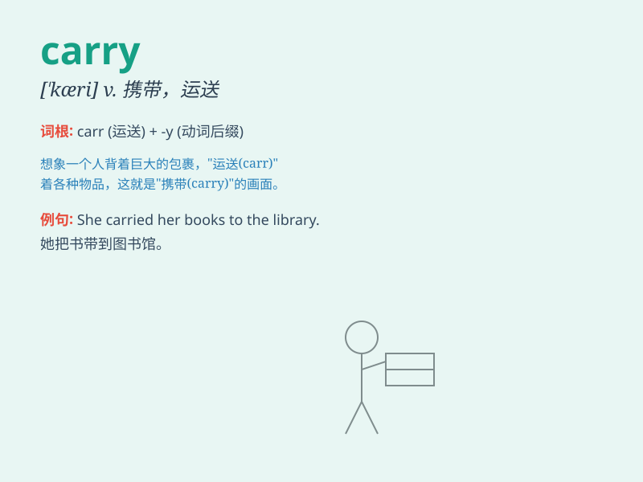

## carry

**英音:** _[\'kærɪ]_ **美音:** _[ˈkærɪ]_

**译义:**
*n.进位,射程,运载vt.携带,运送,支持,支撑,传送,意味vi.被携带,能达到*

### 短语

+ **carry out:** _执行；实行；完成_

+ **carry on:** _继续；进行_

+ **carry forward:** _推进；发扬_

+ **carry off:** _赢得；成功地对付_

+ **carry through:** _完成；使渡过难关_

### 例句

#### 例句1

> **She carried a heavy bag on her shoulder.**

**中文翻译:** 她肩上扛着一个沉重的包。

**单词释义:** 扛；提；拿

#### 例句2

> **The wind carried the sound of music far away.**

**中文翻译:** 风把音乐声传得很远。

**单词释义:** 传送；传播

#### 例句3

> **This new law will carry great significance for our society.**

**中文翻译:** 这项新法律对我们的社会将具有重大意义。

**单词释义:** 具有；包含

### 背诵小故事

> One day, a little ant was trying to carry a big crumb of bread. It
struggled but didn\'t give up. Finally, it successfully carried the
bread home. Just like the ant, \'carry\' means to hold and move
something from one place to another.

**有一天，一只小蚂蚁试图搬运一块大面包屑。它努力挣扎但没有放弃。最终，它成功地把面包搬回了家。就像这只蚂蚁一样，\'carry\'意思是拿着某物并从一个地方移动到另一个地方。**

### 图义

