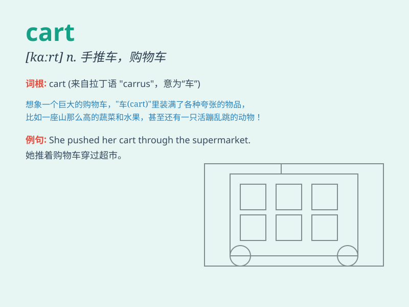

## cart

**英音:** _[kɑːt]_ **美音:** _[kɑrt]_

**译义:** *n.大车,手推车vt.用车装载*

### 短语

+ **shopping cart:** _购物车_

+ **golf cart:** _高尔夫球车_

+ **horse and cart:** _马车_

+ **in the cart:** _处于困境；遇到麻烦_

+ **put the cart before the horse:** _本末倒置_

### 例句

#### 例句1

> **The farmer loaded the hay onto the cart.**

**中文翻译:** 这位农民把干草装上了马车。

**单词释义:** 马车；手推车

#### 例句2

> **She pushed the shopping cart around the supermarket.**

**中文翻译:** 她在超市里推着购物车。

**单词释义:** 购物车

#### 例句3

> **The golf cart sped along the path.**

**中文翻译:** 那辆高尔夫球车沿着小路疾驰。

**单词释义:** 小型机动车；（尤指高尔夫球场上的）电动车

### 背诵小故事

> One day, a farmer was using a cart to carry a lot of fruits to the
market. The cart was old but still very useful. It helped the farmer
transport his goods easily.

**一天，一位农民正用一辆手推车把大量水果运往市场。这辆手推车很旧但仍然非常有用。它帮助农民轻松运输他的货物。**

### 图义

