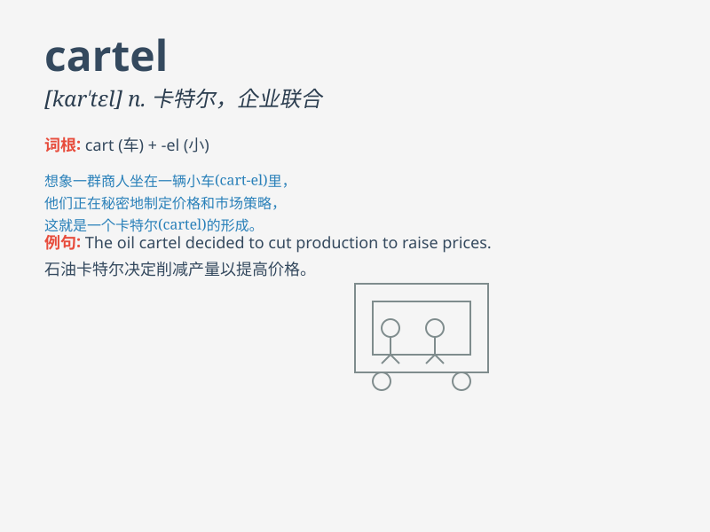

## cartel

**英音:** _[kɑː\'tel]_ **美音:** _[kɑr\'tɛl]_

**译义:** *n.企业联合,交战国间交换俘虏的协议*

### 短语

+ **drug cartel:** _贩毒集团_

+ **oil cartel:** _石油卡特尔_

+ **price cartel:** _价格卡特尔_

+ **cartel agreement:** _卡特尔协议_

+ **export cartel:** _出口卡特尔_

### 例句

#### 例句1

> **The drug cartel has been operating illegally for years.**

**中文翻译:** 这个贩毒集团已经非法运作多年了。

**单词释义:** 卡特尔；企业联合；贩毒集团

#### 例句2

> **The oil cartel controls a large portion of the global oil
market.**

**中文翻译:** 这个石油卡特尔控制着全球石油市场的很大一部分。

**单词释义:** 卡特尔；企业联合

#### 例句3

> **The government is cracking down on the cartel\'s activities.**

**中文翻译:** 政府正在打击这个卡特尔的活动。

**单词释义:** 卡特尔；企业联合

### 背诵小故事

>
想象一下，在一个神秘的小镇，有几个大商人秘密结盟，形成了一个名为\'cartel\'的组织。他们控制着商品的价格和供应，就像一个垄断的小团体。最终，正义到来，打破了这个不良的\'cartel\'。

**想象一下在一个神秘小镇，几个大商人秘密结盟形成名为'卡特尔（垄断联盟）'的组织，控制商品价格和供应，最终正义打破了这个不良的'卡特尔'。**

### 图义

