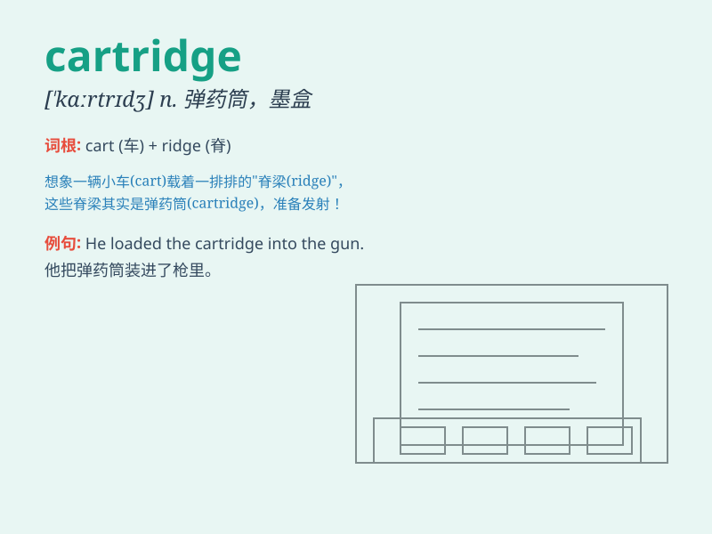

## cartridge

**英音:** _[\'kɑːtrɪdʒ]_ **美音:** _[\'kɑrtrɪdʒ]_

**译义:** *n.弹药筒*

### 短语

+ **ink cartridge:** _墨盒_

+ **toner cartridge:** _硒鼓；碳粉盒_

+ **cartridge case:** _弹壳_

+ **cartridge paper:** _图画纸；厚纸_

+ **print cartridge:** _打印墨盒_

### 例句

#### 例句1

> **The printer is out of ink cartridges.**

**中文翻译:** 这台打印机的墨盒没墨了。

**单词释义:** 墨盒

#### 例句2

> **He loaded a new cartridge into the gun.**

**中文翻译:** 他给枪装上了一个新的子弹夹。

**单词释义:** 子弹夹；弹匣

#### 例句3

> **The audio cartridge needs to be replaced.**

**中文翻译:** 这个音频盒式磁带需要更换。

**单词释义:** 盒式磁带

### 背诵小故事

> One day, a brave adventurer was in a mysterious cave. He found a
special box labeled \'cartridge\'. When he opened it, he saw some
powerful ammunition inside. It was the key to his escape from danger.

**一天，一位勇敢的冒险家在一个神秘的洞穴里。他发现了一个标有"弹药筒"的特殊盒子。当他打开时，看到里面有一些强大的弹药。这是他逃离危险的关键。**

### 图义

