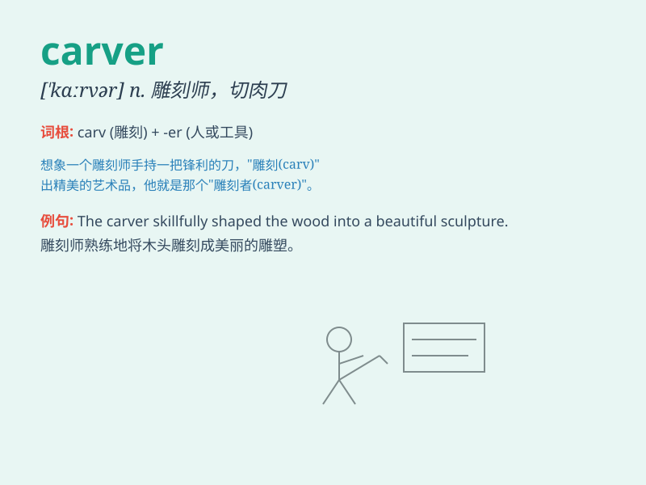

## carver

**英音:** _[ˈkɑːvə]_ **美音:** _[ˈkɑrvər]_

**译义:** *n.雕刻匠,雕工,切肉刀,切肉的人*

### 短语

+ **wood carver:** _木雕艺人_

+ **stone carver:** _石雕艺人_

+ **ice carver:** _冰雕艺人_

+ **professional carver:** _专业雕刻师_

+ **master carver:** _雕刻大师_

### 例句

#### 例句1

> **The carver expertly shaped the wood into a beautiful
sculpture.**

**中文翻译:** 这位雕刻家熟练地将木头雕成了一件美丽的雕塑。

**单词释义:** 雕刻家

#### 例句2

> **The turkey carver sliced the meat neatly for the dinner
guests.**

**中文翻译:** 这位切火鸡的人利落地为晚餐的客人切好了肉。

**单词释义:** 切肉的人

#### 例句3

> **She is a renowned carver of stone.**

**中文翻译:** 她是一位著名的石雕艺人。

**单词释义:** 雕刻者

### 背诵小故事

> A carver is like a magical artist. Imagine a person in a forest,
using a sharp knife to carve beautiful patterns on a big tree trunk. The
person is a carver, turning the plain wood into a wonderful work of art.

**一位雕刻师就像一位神奇的艺术家。想象一个人在森林里，用锋利的刀在一棵大树干上雕刻出美丽的图案。这个人就是雕刻师，将普通的木头变成了一件美妙的艺术品。**

### 图义

