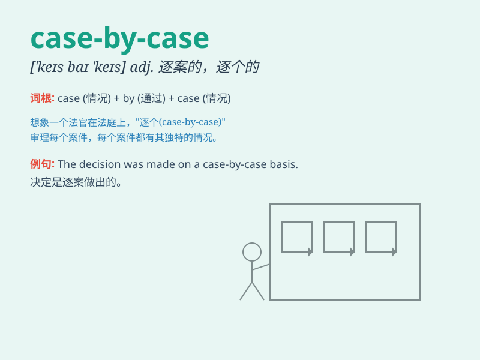

## case-by-case

**英音:** _[keɪs baɪ keɪs]_ **美音:** _[keɪs baɪ keɪs]_

**译义:** *adv. 逐案地；具体情况具体分析地*

### 短语

+ **case-by-case basis:** _逐案处理的原则；个案基础_

+ **case-by-case analysis:** _逐案分析_

+ **case-by-case decision:** _逐案决定_

+ **case-by-case evaluation:** _逐案评估_

+ **case-by-case approach:** _逐案处理的方法_

### 例句

#### 例句1

> **Decisions should be made on a case-by-case basis.**

**中文翻译:** 决策应该根据具体情况逐个做出。

**单词释义:** 逐个；具体情况具体分析

#### 例句2

> **We need to handle each problem on a case-by-case basis.**

**中文翻译:** 我们需要逐个处理每个问题。

**单词释义:** 逐个；根据具体情况

#### 例句3

> **The company assesses job applications on a case-by-case
basis.**

**中文翻译:** 公司对工作申请逐个进行评估。

**单词释义:** 逐个；按具体情况

### 背诵小故事

> A detective was solving crimes case-by-case. Each case was unique and
needed careful examination. Just like this, we should deal with problems
one by one, carefully and specifically.

**一位侦探在逐个案件地侦破犯罪。每个案件都是独特的，需要仔细审查。就像这样，我们应该一个一个地、仔细且具体地处理问题。**

### 图义

