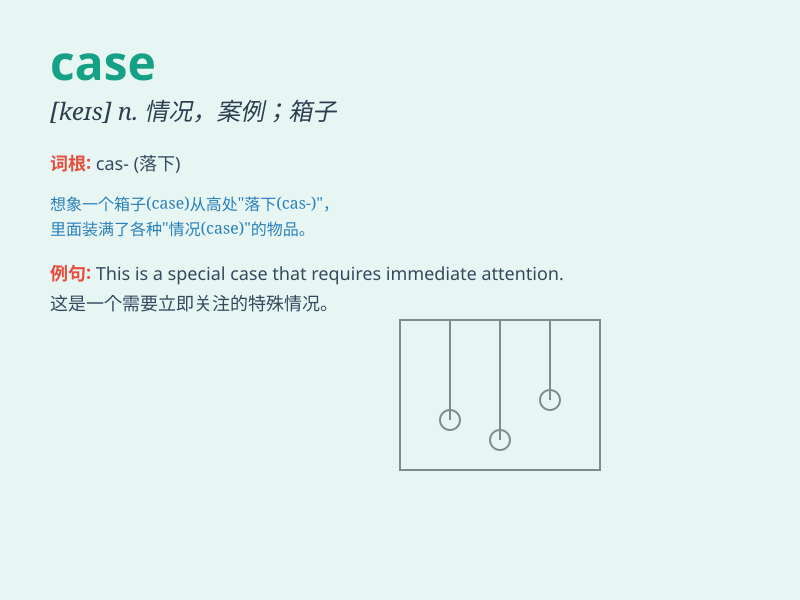

## case

**英音:** _[keɪs]_ **美音:** _[kes]_

**译义:** *n.事,病例,案例,情形,场合,讼案,容器,(语法)格*

### 短语

+ **in case:** _以防；万一_

+ **in any case:** _无论如何；不管怎样_

+ **in case of:** _万一；如果发生；防备_

+ **a case in point:** _恰当的例子；明证_

+ **make out a case:** _提出充分的理由；证明有理由_

### 例句

#### 例句1

> **In this case, we need to act quickly.**

**中文翻译:** 在这种情况下，我们需要迅速行动。

**单词释义:** 情况；情形

#### 例句2

> **The detective is working on a difficult case.**

**中文翻译:** 这位侦探正在处理一起棘手的案件。

**单词释义:** 案件；事例

#### 例句3

> **She carried a small case on the train.**

**中文翻译:** 她在火车上提着一个小箱子。

**单词释义:** 箱子；容器

### 背诵小故事

> A detective was working on a mysterious case. The key to solving it
was hidden in a small suitcase. He finally found the clue and cracked
the case.

**一位侦探正在处理一起神秘的案件。解开它的关键藏在一个小手提箱里。他最终找到了线索并破了案。**

### 图义

