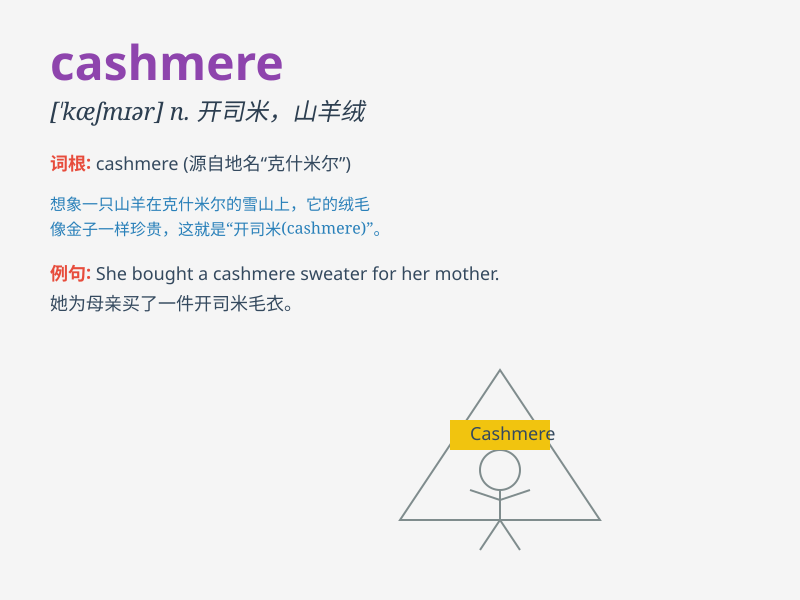

## cashmere

**英音:** _[kæʃ\'mɪə; \'kæʃmɪə]_ **美音:** _[\'kæʒmɪr]_

**译义:** *n.[纺]开士米,山羊绒,羊绒,开士米织物,开士米绒线*

### 短语

+ **cashmere sweater:** _羊绒衫_

+ **cashmere scarf:** _羊绒围巾_

+ **cashmere coat:** _羊绒大衣_

+ **pure cashmere:** _纯羊绒_

+ **cashmere fabric:** _羊绒织物_

### 例句

#### 例句1

> **She wore a cashmere sweater that felt incredibly soft.**

**中文翻译:** 她穿着一件羊绒衫，感觉非常柔软。

**单词释义:** 羊绒；开司米

#### 例句2

> **The scarf was made of pure cashmere and was very warm.**

**中文翻译:** 围巾是纯羊绒的，非常保暖。

**单词释义:** 羊绒；开司米

#### 例句3

> **I bought a cashmere coat as a birthday present for my mother.**

**中文翻译:** 我给妈妈买了一件羊绒大衣作为生日礼物。

**单词释义:** 羊绒；开司米

### 背诵小故事

> A princess traveled to a faraway land and was given a soft, warm
shawl. When asked about it, she was told it was made of cashmere. She
loved it so much and always remembered the word.

**一位公主去了遥远的地方旅行，有人送给她一条柔软温暖的披肩。当问起这是什么材质时，被告知是羊绒的。公主非常喜欢，也因此记住了cashmere这个词。**

### 图义

