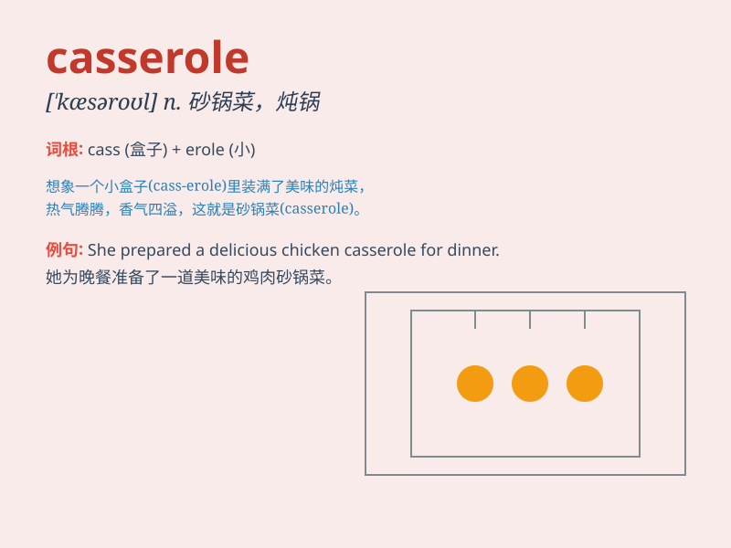

## casserole

**英音:** _[\'kæsərəʊl]_ **美音:** _[\'kæsərol]_

**译义:** *n.餐桌上用有盖的焙盘,砂锅菜*

### 短语

+ **casserole dish:** _砂锅菜盘_

+ **chicken casserole:** _鸡肉砂锅菜_

+ **vegetable casserole:** _蔬菜砂锅菜_

+ **beef casserole:** _牛肉砂锅菜_

+ **casserole recipe:** _砂锅菜食谱_

### 例句

#### 例句1

> **I made a delicious chicken casserole for dinner.**

**中文翻译:** 我做了美味的鸡肉砂锅当晚餐。

**单词释义:** 砂锅菜；炖锅菜

#### 例句2

> **The casserole dish is in the cupboard.**

**中文翻译:** 砂锅菜在柜子里。

**单词释义:** 砂锅；炖锅

#### 例句3

> **She served the casserole to the guests with a smile.**

**中文翻译:** 她微笑着把砂锅菜端给客人。

**单词释义:** 砂锅菜

### 背诵小故事

> A chef was cooking a special dish in a big casserole. The casserole
was like a magic pot, making the food delicious. One day, a little mouse
wanted to taste the food but couldn\'t reach it. Remember, the pot is
called \'casserole\'!

**一位厨师正在一个大砂锅（casserole）里烹饪一道特别的菜肴。这个砂锅就像一个神奇的锅，能让食物变得美味。有一天，一只小老鼠想尝尝食物但够不着。记住，这个锅叫'砂锅'！**

### 图义

