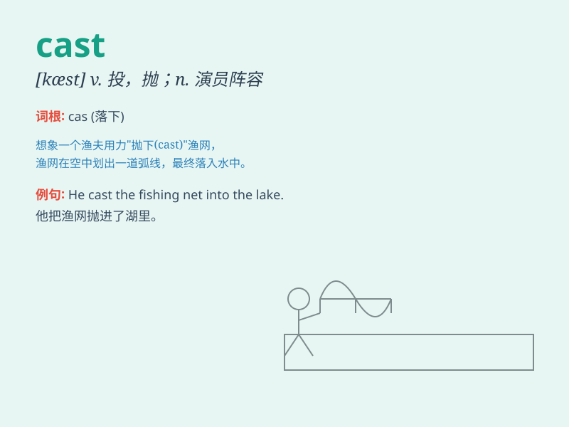

## cast

**英音:** _[kɑːst]_ **美音:** _[kæst]_

**译义:**
*n.投掷,铸件,脱落物,一瞥,演员表v.投,抛,投射,浇铸,计算,派(角色)*

### 短语

+ **cast aside:** _抛弃；丢弃_

+ **cast away:** _扔掉；丢弃；使（船）漂流_

+ **cast down:** _使沮丧；使不愉快；使失望_

+ **cast off:** _解缆；解（船）；抛弃；丢弃_

+ **cast out:** _驱逐；赶走；开除_

### 例句

#### 例句1

> **The actor was cast in the lead role of the movie.**

**中文翻译:** 该演员被选为这部电影的主角。

**单词释义:** 挑选（演员）

#### 例句2

> **She cast a glance at me and smiled.**

**中文翻译:** 她看了我一眼，笑了。

**单词释义:** 投，抛，投射（目光）

#### 例句3

> **The fisherman cast his net into the sea.**

**中文翻译:** 渔夫把网撒进海里。

**单词释义:** 撒（网）

### 背诵小故事

> A director was casting actors for a new play. He needed to find the
perfect cast. Finally, he selected a group of talented actors and the
play was a great success.

**一位导演正在为一部新剧挑选演员。他需要找到完美的演员阵容。最后，他选了一组有才华的演员，这部剧大获成功。**

### 图义

