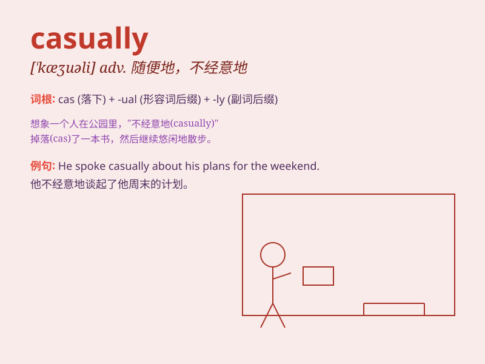

## casually

**英音:** _[\'kæʒjʊəlɪ]_ **美音:** _[\'kæʒjʊrlɪ]_

**译义:** *adv.偶然地,随便地,临时地*

### 短语

+ **casually dressed:** _穿着随意_

+ **casually mention:** _随口提及_

+ **casually stroll:** _随意漫步_

+ **casually glance:** _随意一瞥_

+ **casually chat:** _随意聊天_

### 例句

#### 例句1

> **He casually mentioned that he was thinking of changing jobs.**

**中文翻译:** 他漫不经心地提到他正在考虑换工作。

**单词释义:** 随便地；漫不经心地

#### 例句2

> **She was dressed casually in jeans and a T-shirt.**

**中文翻译:** 她穿着休闲的牛仔裤和T恤。

**单词释义:** 随意地；休闲地

#### 例句3

> **They chatted casually over coffee.**

**中文翻译:** 他们一边喝咖啡一边随意地聊天。

**单词释义:** 随意；随便

### 背诵小故事

> One day, Tom was walking in the park. He met an old friend and they
talked casually. They didn\'t have a serious topic but just shared some
funny things in daily life.

**一天，汤姆在公园散步。他遇到一位老朋友，他们随意地交谈。他们没有严肃的话题，只是分享了一些日常生活中的有趣事情。**

### 图义

