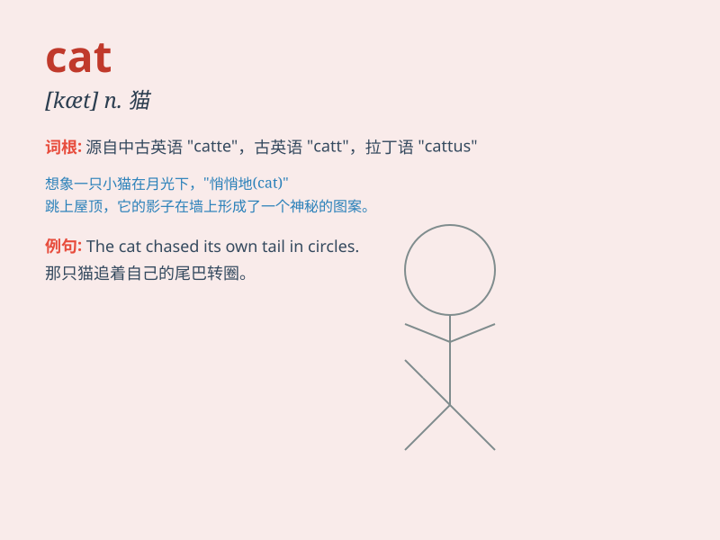

## cat

**英音:** _[kæt]_ **美音:** _[kæt]_

**译义:** *n.猫；猫科动物；狠毒的女人；吊锚机；独桅船；九尾鞭*

### 短语

+ **black cat:** _黑猫_

+ **stray cat:** _流浪猫_

+ **fat cat:** _有钱有势的人_

+ **scaredy cat:** _胆小鬼_

+ **copy cat:** _盲目的模仿者_

### 例句

#### 例句1

> **The cat is sleeping on the sofa.**

**中文翻译:** 这只猫正在沙发上睡觉。

**单词释义:** 猫

#### 例句2

> **I saw a black cat crossing the street.**

**中文翻译:** 我看到一只黑猫穿过街道。

**单词释义:** 猫

#### 例句3

> **She has a cute cat as her pet.**

**中文翻译:** 她有一只可爱的猫作为宠物。

**单词释义:** 猫

### 背诵小故事

> One day, a little girl was walking in the park. Suddenly, a cute cat
jumped out from behind a tree. The cat had soft fur and big eyes. The
girl was so happy to see it and wanted to play with the cat.

**有一天，一个小女孩在公园里散步。突然，一只可爱的猫从一棵树后面跳了出来。这只猫有着柔软的毛和大大的眼睛。小女孩看到它非常高兴，想要和这只猫一起玩。**

### 图义

