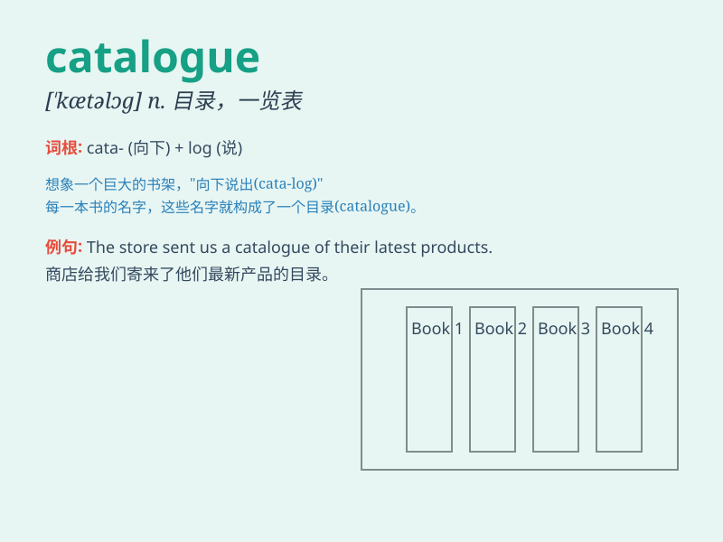

## catalogue

**英音:** _[\'kæt(ə)lɒg]_ **美音:** _[\'kætəlɔɡ]_

**译义:** *n.目录*

### 短语

+ **catalogue of products:** _产品目录_

+ **library catalogue:** _图书馆目录_

+ **catalogue number:** _目录编号_

+ **illustrated catalogue:** _插图目录_

+ **electronic catalogue:** _电子目录_

### 例句

#### 例句1

> **You can find the book in the library catalogue.**

**中文翻译:** 您可以在图书馆目录中找到这本书。

**单词释义:** 目录

#### 例句2

> **The company sent me a catalogue of their new products.**

**中文翻译:** 该公司寄给我一份他们的新产品目录。

**单词释义:** 目录；一览表

#### 例句3

> **She spent hours cataloguing her stamp collection.**

**中文翻译:** 她花了几个小时对她收藏的邮票进行编目。

**单词释义:** 为...编目录

### 背诵小故事

>
想象一下，在一个巨大的图书馆里，有个小精灵拿着一本魔法书，书里记录着所有书籍的信息，这就像一个'catalogue'（目录）。人们通过它能快速找到想要的书。

**想象在图书馆中，小精灵拿着的记录所有书籍信息的魔法书就像'目录'，帮助人们快速找书。**

### 图义

