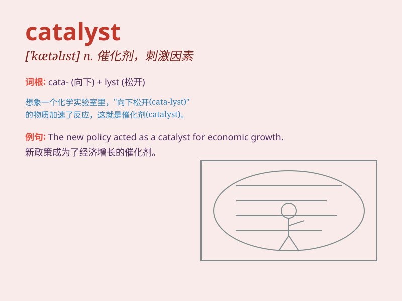

## catalyst

**英音:** _[\'kæt(ə)lɪst]_ **美音:** _[\'kætəlɪst]_

**译义:** *n.催化剂*

### 短语

+ **positive catalyst:** _正催化剂_

+ **chemical catalyst:** _化学催化剂_

+ **catalyst poisoning:** _催化剂中毒_

+ **heterogeneous catalyst:** _多相催化剂_

+ **homogeneous catalyst:** _均相催化剂_

### 例句

#### 例句1

> **The new policy acted as a catalyst for economic growth.**

**中文翻译:** 新政策对经济增长起到了催化剂的作用。

**单词释义:** 催化剂；促进因素

#### 例句2

> **His speech was the catalyst that sparked the protest.**

**中文翻译:** 他的讲话成为引发抗议的催化剂。

**单词释义:** 引发...的因素

#### 例句3

> **She was the catalyst for change in the organization.**

**中文翻译:** 她是组织变革的催化剂。

**单词释义:** 促使变化的人或事物

### 背诵小故事

> A scientist was conducting experiments. One day, a mysterious
substance was accidentally added, which turned out to be the catalyst
that made the reaction proceed rapidly and successfully. It was like a
magic key that unlocked the door to a breakthrough.

**一位科学家正在做实验。有一天，一种神秘的物质意外被加入，结果它成了催化剂，使反应迅速且成功地进行。它就像一把神奇的钥匙，打开了取得突破的大门。**

### 图义

