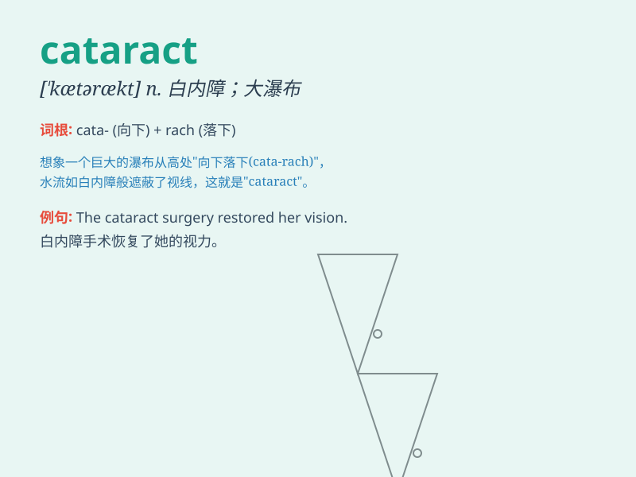

## cataract

**英音:** _[\'kætərækt]_ **美音:** _[\'kætərækt]_

**译义:** *n.大瀑布,奔流,白内障*

### 短语

+ **senile cataract:** _老年性白内障_

+ **congenital cataract:** _先天性白内障_

+ **traumatic cataract:** _外伤性白内障_

+ **complicated cataract:** _并发性白内障_

+ **posterior cataract:** _后发性白内障_

### 例句

#### 例句1

> **The doctor diagnosed her with a cataract in her left eye.**

**中文翻译:** 医生诊断她的左眼患有白内障。

**单词释义:** 白内障

#### 例句2

> **The waterfall is like a cataract, plunging down from the
cliff.**

**中文翻译:** 瀑布犹如瀑布，从悬崖上飞流直下。

**单词释义:** 大瀑布

#### 例句3

> **The old man\'s vision was impaired by a cataract.**

**中文翻译:** 这位老人的视力因白内障而受损。

**单词释义:** 白内障

### 背诵小故事

> A brave adventurer was exploring a deep cave. Suddenly, a huge
waterfall blocked the way. The water rushed down like a \'cataract\',
making a deafening noise. The adventurer had to find another route.

**一位勇敢的探险家正在探索一个深洞。突然，一道巨大的瀑布挡住了去路。水像'白内障（或大瀑布）'一样倾泻而下，发出震耳欲聋的声音。探险家不得不另寻出路。**

### 图义

