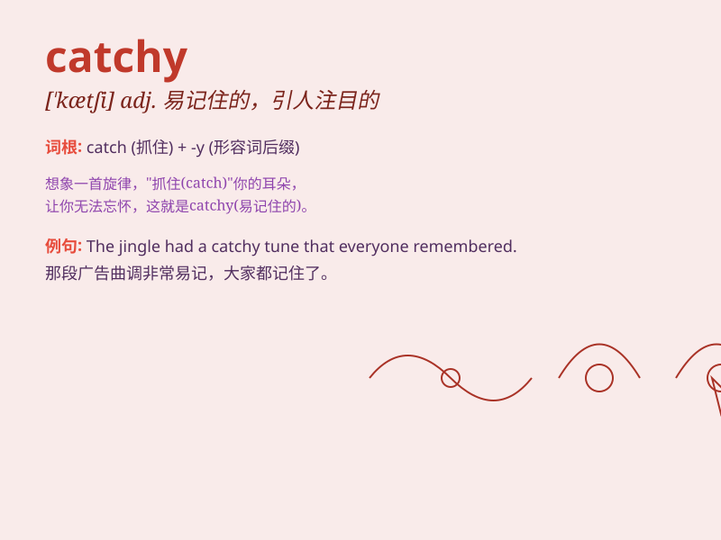

## catchy

**英音:** _[\'kætʃɪ]_ **美音:** _[\'kætʃi]_

**译义:** *adj.易记住的,易使人上当的,诡诈的*

### 短语

+ **catchy tune:** _动人的曲调_

+ **catchy slogan:** _吸引人的口号_

+ **catchy melody:** _动听的旋律_

+ **catchy title:** _吸引人的标题_

+ **catchy phrase:** _朗朗上口的短语_

### 例句

#### 例句1

> **The song has a very catchy melody.**

**中文翻译:** 这首歌的旋律非常朗朗上口。

**单词释义:** 吸引人的

#### 例句2

> **The advertisement had a catchy slogan.**

**中文翻译:** 该广告有一个朗朗上口的口号。

**单词释义:** 吸引人的

#### 例句3

> **Her presentation was full of catchy ideas.**

**中文翻译:** 她的演讲充满了吸引人的想法。

**单词释义:** 吸引人的

### 背诵小故事

> A musician was struggling to create a song. One day, inspiration
struck and he composed a melody that was so catchy. Everyone who heard
it couldn\'t stop humming. The word \'catchy\' means easily remembered
and pleasing.

**一位音乐家一直在努力创作一首歌。有一天，灵感来袭，他创作了一段非常动听易记的旋律。每个听到的人都忍不住哼唱。单词\'catchy\'意思是容易记住的、动听的。**

### 图义

