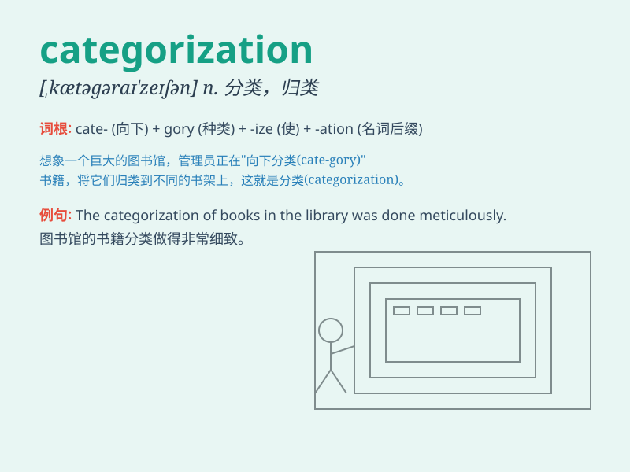

## categorization

**英音:** _[ˌkætəɡəraɪˈzeɪʃən]_ **美音:**
_[ˌkætəɡərəˈzeɪʃən]_

**译义:** *n.分类，类别化，归类*

### 短语

+ **job categorization:** _工作分类_

+ **data categorization:** _数据分类_

+ **product categorization:** _产品分类_

+ **risk categorization:** _风险分类_

+ **information categorization:** _信息分类_

### 例句

#### 例句1

> **The categorization of books in the library is very clear.**

**中文翻译:** 图书馆里书籍的分类非常清晰。

**单词释义:** 分类

#### 例句2

> **This new system simplifies the categorization of products.**

**中文翻译:** 这个新系统简化了产品的分类。

**单词释义:** 分类

#### 例句3

> **The categorization of students based on their grades is
controversial.**

**中文翻译:** 根据学生的成绩进行分类是有争议的。

**单词释义:** 分类

### 背诵小故事

> Imagine a big library. There are countless books. To organize them
neatly, we need categorization. We group books like fiction,
non-fiction, history, etc. This way, finding a specific book becomes
easy. Categorization means putting things into different groups or
classes.

**想象一个大图书馆。有无数的书。为了整齐地整理它们，我们需要分类。我们把书分成小说、非小说、历史等类别。这样，找到特定的书就变得容易了。categorization
意思是把事物分成不同的组或类别。**

### 图义

