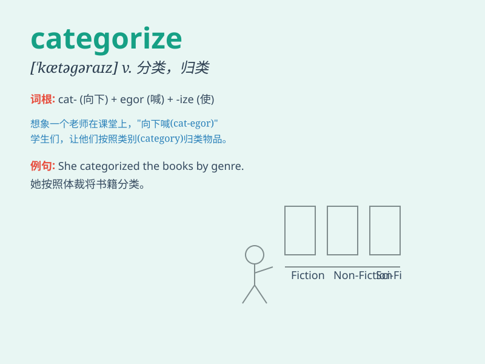

## categorize

**英音:** _[\'kætəɡəraɪz]_ **美音:** _[\'kætəgə\'raɪz]_

**译义:** *v.加以类别,分类*

### 短语

+ **categorize as:** _归类为_

+ **categorize into:** _分类成_

+ **be categorized under:** _被归在\...\...之下_

+ **categorize according to:** _根据\...\...分类_

+ **difficult to categorize:** _难以分类_

### 例句

#### 例句1

> **The library categorizes books by subject and author.**

**中文翻译:** 图书馆按主题和作者对书籍进行分类。

**单词释义:** 把\...\...分类

#### 例句2

> **It\'s difficult to categorize his music as a specific genre.**

**中文翻译:** 很难将他的音乐归类为特定流派。

**单词释义:** 归类

#### 例句3

> **Scientists categorize animals based on their characteristics.**

**中文翻译:** 科学家根据动物的特征对它们进行分类。

**单词释义:** 分类

### 背诵小故事

> A librarian was categorizing books. She put fiction in one section
and non-fiction in another. By doing this, she was categorizing them
based on their types. It helped readers find books easily.

**一位图书管理员正在给书籍分类。她把小说放在一个区域，非小说放在另一个区域。通过这样做，她根据书籍的类型对它们进行分类。这有助于读者轻松找到书籍。**

### 图义

