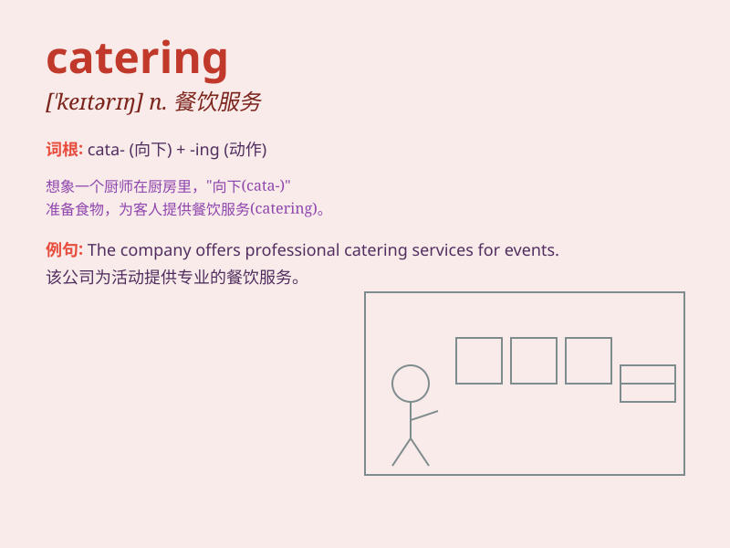

## catering

**英音:** _[ˈkeɪtərɪŋ]_ **美音:** _[ˈketərɪŋ]_

**译义:** *n.饮食供应, 餐饮服务; 餐饮部/组
(酒店、公司等为顾客或职工提供餐饮服务的部门或单位)*

### 短语

+ **catering service:** _餐饮服务_

+ **catering industry:** _餐饮业_

+ **catering business:** _餐饮生意_

+ **catering staff:** _餐饮工作人员_

+ **catering equipment:** _餐饮设备_

### 例句

#### 例句1

> **The catering at the wedding was excellent.**

**中文翻译:** 婚礼上的餐饮非常出色。

**单词释义:** 餐饮服务

#### 例句2

> **We hired a catering company for the party.**

**中文翻译:** 我们为聚会雇了一家餐饮公司。

**单词释义:** 提供餐饮服务

#### 例句3

> **The hotel\'s catering department is very busy during the tourist
season.**

**中文翻译:** 在旅游旺季，这家酒店的餐饮部门非常忙碌。

**单词释义:** 餐饮部门

### 背诵小故事

> Once upon a time, there was a chef who was passionate about catering.
He prepared delicious food for various events, making everyone happy.
His catering business grew, and he became famous for his excellent
service.

**从前，有一位厨师热衷于餐饮服务。他为各种活动准备美味的食物，让每个人都开心。他的餐饮业务不断发展，他也因出色的服务而出名。**

### 图义

