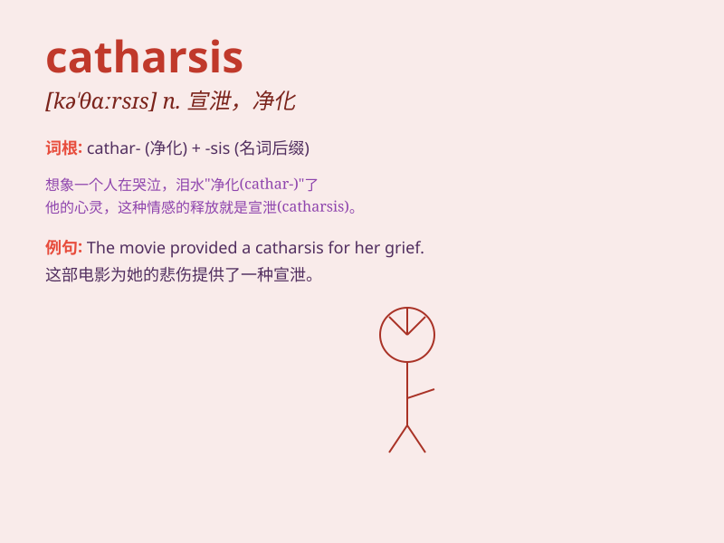

## catharsis

**英音:** _[kə\'θɑːsɪs]_ **美音:** _[kə\'θɑrsɪs]_

**译义:**
*n.[医]导泻(尤指通便),泻法,[精神病](精神或心理)疏泄,宣泄*

### 短语

+ **emotional catharsis:** _情感宣泄_

+ **psychological catharsis:** _心理宣泄_

+ **achieve catharsis:** _达到宣泄_

+ **need catharsis:** _需要宣泄_

+ **experience catharsis:** _经历宣泄_

### 例句

#### 例句1

> **The movie provided a catharsis for her pent-up emotions.**

**中文翻译:** 这部电影为她压抑的情绪提供了宣泄。

**单词释义:** 宣泄，情感的抒发

#### 例句2

> **Writing poetry was his form of catharsis after a difficult
breakup.**

**中文翻译:** 写诗是他在经历了艰难的分手后的宣泄方式。

**单词释义:** 情感的宣泄

#### 例句3

> **The intense workout served as a catharsis for all the stress of
the week.**

**中文翻译:** 高强度的锻炼可以宣泄一周的所有压力。

**单词释义:** 释放，排解

### 背诵小故事

> A man was stressed and filled with negative emotions. One day, he
decided to write down all his feelings. Through this process, he
experienced a catharsis and felt much better. It was like a release of
all the pent-up emotions inside him.

**一个男人压力很大，充满了负面情绪。有一天，他决定把自己所有的感受都写下来。通过这个过程，他经历了一次精神宣泄，感觉好多了。这就像是释放了他内心压抑的所有情绪。**

### 图义

