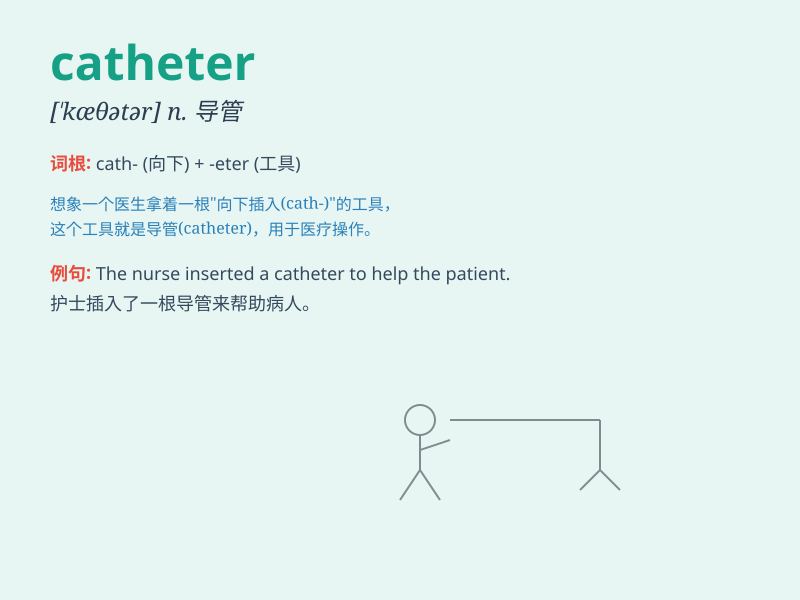

## catheter

**英音:** _[\'kæθɪtə]_ **美音:** _[\'kæθɪtɚ]_

**译义:** *n.[医]导尿管,尿液管,导管*

### 短语

+ **cardiac catheter:** _心导管_

+ **urethral catheter:** _尿道导管_

+ **venous catheter:** _静脉导管_

+ **indwelling catheter:** _留置导管_

+ **central venous catheter:** _中心静脉导管_

### 例句

#### 例句1

> **The doctor inserted a catheter into the patient\'s vein.**

**中文翻译:** 医生将一根导管插入病人的静脉。

**单词释义:** 导管

#### 例句2

> **The catheter was used to drain the fluid from the body.**

**中文翻译:** 导管用于排出体内的液体。

**单词释义:** 导管

#### 例句3

> **She was uncomfortable with the catheter in place.**

**中文翻译:** 她对导管就位感到不舒服。

**单词释义:** 导管

### 背诵小故事

> A doctor needed to insert a catheter to help a patient. The patient
was very nervous, but the doctor said, \'Don\'t worry, this catheter
will make you feel better soon.\'

**一位医生需要插入一根导管来帮助一位病人。病人非常紧张，但医生说："别担心，这根导管很快会让你感觉好起来。"**

### 图义

