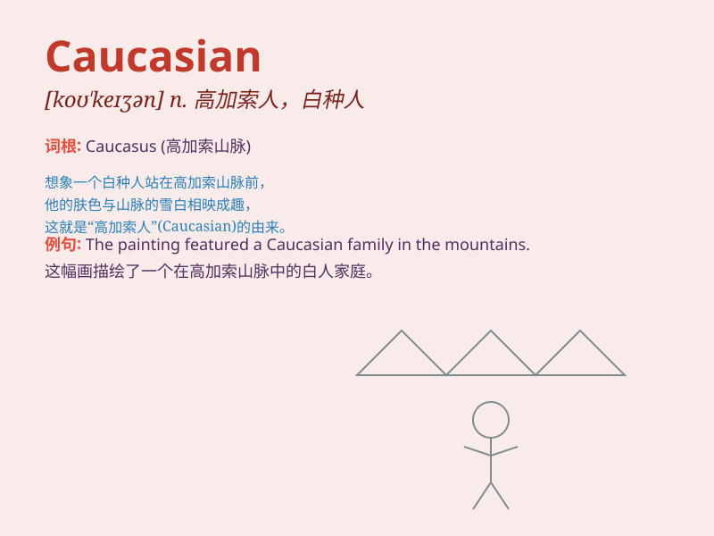

## Caucasian

**英音:** _[kɔːˈkeɪziən]_ **美音:** _[kɔːˈkeɪziən]_

**译义:** *n.高加索人；白种人adj.高加索人的；白种人的*

### 短语

+ **Caucasian race:** _高加索人种_

+ **Caucasian features:** _高加索人的特征_

+ **Caucasian population:** _高加索人口_

+ **Caucasian woman:** _高加索女性_

+ **Caucasian man:** _高加索男性_

### 例句

#### 例句1

> **The majority of the population in this area are Caucasian.**

**中文翻译:** 这个地区的大部分人口是高加索人。

**单词释义:** 高加索人

#### 例句2

> **She has typical Caucasian features such as fair skin and blue
eyes.**

**中文翻译:** 她有典型的高加索人的特征，比如白皙的皮肤和蓝色的眼睛。

**单词释义:** 高加索人的

#### 例句3

> **The study focused on the health issues of Caucasian men over
50.**

**中文翻译:** 这项研究聚焦于 50 岁以上高加索男性的健康问题。

**单词释义:** 高加索人的

### 背诵小故事

> Once upon a time, in a faraway land, there was a special group of
people called Caucasian. They had distinct features and a unique
culture. One day, a traveler met them and was amazed by their charm.

**从前，在一个遥远的地方，有一个特殊的人群被称为高加索人。他们有独特的特征和独特的文化。有一天，一位旅行者遇到了他们，并对他们的魅力感到惊讶。**

### 图义

