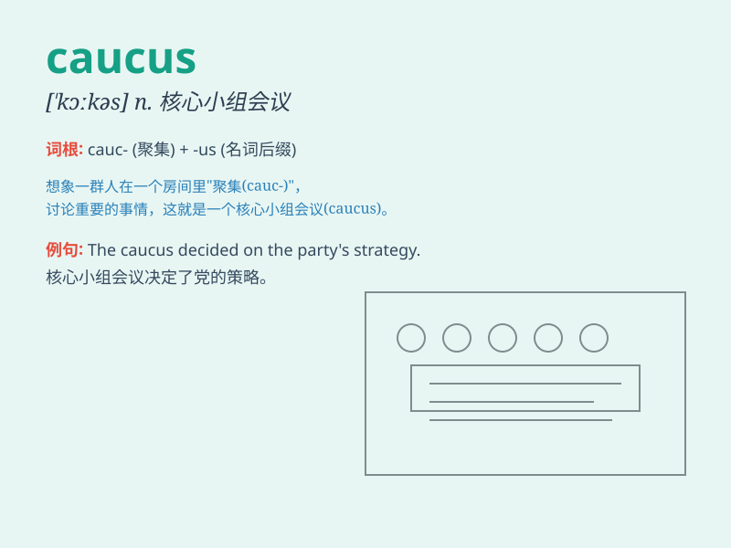

## caucus

**英音:** _[\'kɔːkəs]_ **美音:** _[\'kɔkəs]_

**译义:**
*n.(政党的)领导人秘密会议,核心小组会议vi.举行或参加政党领导层秘密的预备会议*

### 短语

+ **caucus meeting:** _核心会议_

+ **political caucus:** _政治核心小组_

+ **caucus race:** _核心小组竞选_

+ **legislative caucus:** _立法核心小组_

+ **caucus system:** _核心小组制度_

### 例句

#### 例句1

> **The local caucus was held to select the party\'s candidate for
the upcoming election.**

**中文翻译:**
当地的党团会议举行是为了选出该党即将到来的选举的候选人。

**单词释义:** 党团会议；核心小组会议

#### 例句2

> **The caucus of senators discussed the new legislation in
detail.**

**中文翻译:** 参议员的核心小组详细讨论了新的立法。

**单词释义:** 核心小组

#### 例句3

> **She was actively involved in the political caucus to promote her
policy agenda.**

**中文翻译:** 她积极参与政治核心小组以推动她的政策议程。

**单词释义:** 核心小组

### 背诵小故事

> In a small town, politicians gathered for a caucus. They discussed
plans in a secret room. A curious kid peeked in and learned about the
important decisions. Remember, a caucus is a meeting of a group within a
political party.

**在一个小镇上，政客们为了一场核心会议聚集。他们在一个秘密房间里讨论计划。一个好奇的孩子偷看，了解到了重要的决定。记住，caucus
指的是政党内部的小组会议。**

### 图义

