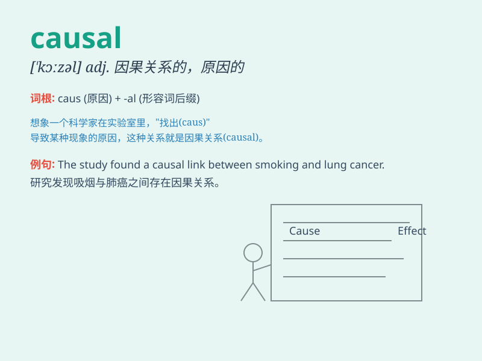

## causal

**英音:** _[\'kɔːz(ə)l]_ **美音:** _[\'kɔzl]_

**译义:**
*adj.原因的,因果关系的,表示原因或理由的n.表示原因的词(如连词)*

### 短语

+ **causal factor:** _起因；致病因素_

+ **causal relationship:** _因果关系_

+ **causal connection:** _因果联系_

+ **causal analysis:** _因果分析_

+ **causal inference:** _因果推断_

### 例句

#### 例句1

> **The study aimed to identify the causal factors of the
disease.**

**中文翻译:** 这项研究旨在确定这种疾病的致病因素。

**单词释义:** 原因的；因果关系的

#### 例句2

> **There is a causal connection between smoking and lung cancer.**

**中文翻译:** 吸烟和肺癌之间有因果关系。

**单词释义:** 因果关系的

#### 例句3

> **The causal relationship between stress and poor health is well
documented.**

**中文翻译:** 压力和健康状况不佳之间的因果关系有充分的文献记载。

**单词释义:** 因果的

### 背诵小故事

> A scientist was studying a disease. He found that a certain virus was
the causal factor. Without this virus, the disease wouldn\'t happen. So,
\'causal\' means causing or relating to a cause.

**一位科学家正在研究一种疾病。他发现某种病毒是致病因素。没有这种病毒，疾病就不会发生。所以，\'causal\'意思是引起的或与原因有关的。**

### 图义

