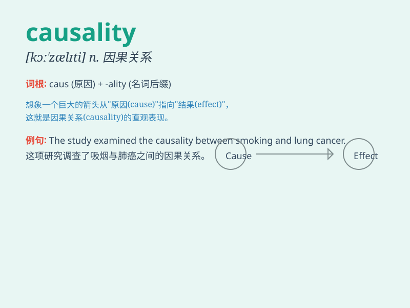

## causality

**英音:** _[kɔː\'zælɪtɪ]_ **美音:** _[kɔ\'zæləti]_

**译义:** *n.因果关系*

### 短语

+ **causal relationship:** _因果关系_

+ **causality principle:** _因果性原理_

+ **causality analysis:** _因果分析_

+ **linear causality:** _线性因果关系_

+ **complex causality:** _复杂因果关系_

### 例句

#### 例句1

> **The study aims to explore the causality between smoking and lung
cancer.**

**中文翻译:** 这项研究旨在探究吸烟和肺癌之间的因果关系。

**单词释义:** 因果关系

#### 例句2

> **Scientists are still debating the causality of the
phenomenon.**

**中文翻译:** 科学家们仍在争论这种现象的因果关系。

**单词释义:** 因果关系

#### 例句3

> **It\'s difficult to establish a clear causality in this complex
situation.**

**中文翻译:** 在这种复杂的情况下很难确立明确的因果关系。

**单词释义:** 因果关系

### 背诵小故事

> One day, a scientist was studying a series of events. He found that
one event always led to another, and this connection was called
causality. Just like a domino effect, each cause had an effect.

**有一天，一位科学家在研究一系列事件。他发现一个事件总是导致另一个事件，这种联系就被称为因果关系。就像多米诺骨牌效应，每个原因都有一个结果。**

### 图义

