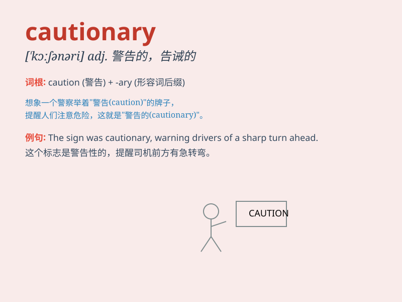

## cautionary

**英音:** _[\'kɔːʃ(ə)n(ə)rɪ]_ **美音:** _[\'kɔʃənɛri]_

**译义:** *adj.警戒的*

### 短语

+ **cautionary tale:** _警世故事_

+ **cautionary note:** _警示说明_

+ **cautionary measure:** _预防措施_

+ **cautionary advice:** _告诫性建议_

+ **cautionary signal:** _警示信号_

### 例句

#### 例句1

> **The story serves as a cautionary tale about the dangers of
greed.**

**中文翻译:** 这个故事作为一个关于贪婪危险的警示故事。

**单词释义:** 警示的

#### 例句2

> **The doctor gave a cautionary note about the side effects of the
medication.**

**中文翻译:** 医生就这种药物的副作用给出了一个警告性的说明。

**单词释义:** 警告性的

#### 例句3

> **The cautionary signs along the road warned drivers of the
upcoming sharp turn.**

**中文翻译:** 沿路的警示标志提醒司机即将到来的急转弯。

**单词释义:** 警示的

### 背诵小故事

> A young detective was always cautiousary when solving cases. Once, he
ignored a small clue and almost made a big mistake. From then on, he
reminded himself to be extra careful. This made him a great detective.

**一位年轻的侦探在破案时总是小心谨慎。有一次，他忽略了一个小线索，差点犯下大错。从那以后，他提醒自己要格外小心。这使他成为了一名出色的侦探。**

### 图义

