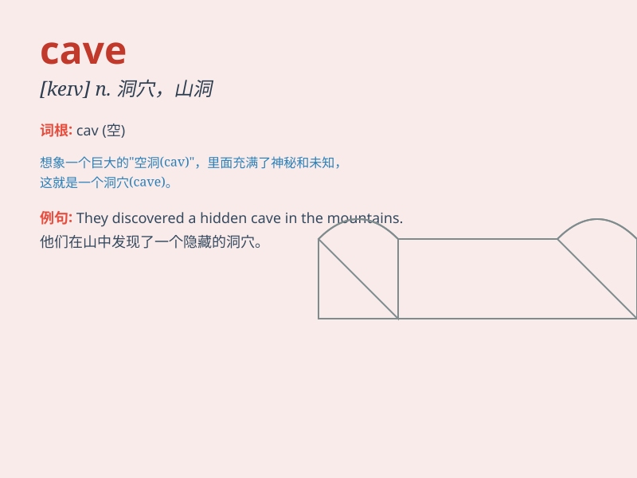

## cave

**英音:** _[keɪv]_ **美音:** _[kev]_

**译义:** *n.洞穴,窑洞vi.凹陷,投降vt.挖洞,使凹陷*

### 短语

+ **cave in:** _坍塌；屈服；投降_

+ **cave dweller:** _穴居者_

+ **sea cave:** _海蚀洞；海洞_

+ **limestone cave:** _石灰岩溶洞_

+ **cave exploration:** _洞穴探险_

### 例句

#### 例句1

> **The explorers entered the cave cautiously.**

**中文翻译:** 探险者们小心翼翼地进入了洞穴。

**单词释义:** 洞穴

#### 例句2

> **The cave was filled with stalactites and stalagmites.**

**中文翻译:** 这个洞穴里布满了钟乳石和石笋。

**单词释义:** 洞穴

#### 例句3

> **He decided to cave in and apologize.**

**中文翻译:** 他决定屈服并道歉。

**单词释义:** 屈服

### 背诵小故事

> A brave explorer was lost in a dark forest. When it rained heavily,
he luckily found a cave. It was deep and quiet inside. He took shelter
there and was safe. The cave became his savior.

**一位勇敢的探险家在黑暗的森林中迷路了。当雨下得很大时，他幸运地发现了一个洞穴。里面又深又安静。他在那里躲避，安然无恙。这个洞穴成了他的救星。**

### 图义

