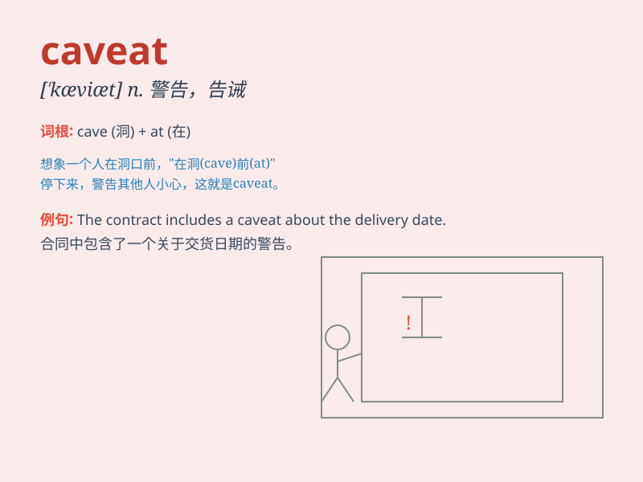

## caveat

**英音:** _[\'kævɪæt; \'keɪ-]_ **美音:** _[\'kævɪæt;
\'ke-]_

**译义:** *n.[律]中止诉讼手续的申请,警告,告诫*

### 短语

+ **enter a caveat:** _提出警告_

+ **caveat emptor:** _买主自负；购者自慎_

+ **with caveat:** _带有警告；有附带条件_

+ **issue a caveat:** _发布警告_

+ **ignore the caveat:** _忽视警告_

### 例句

#### 例句1

> **The contract came with a caveat that the delivery date could
change.**

**中文翻译:** 这份合同有一个附带条件，即交货日期可能会改变。

**单词释义:** 警告；告诫；限制条款

#### 例句2

> **Buyers should be aware of the caveat when considering this
investment.**

**中文翻译:** 买家在考虑这项投资时应该注意这个警告。

**单词释义:** 警告；提醒

#### 例句3

> **There is a caveat to the success of this plan - the availability
of funds.**

**中文翻译:** 这个计划成功有一个限制条件------资金的可用性。

**单词释义:** 限制条件；警告

### 背诵小故事

> A young adventurer was about to enter a mysterious cave. Just as he
was about to step in, an old wise man appeared and gave him a caveat:
\'Beware of hidden traps inside!\' The adventurer understood the warning
and was cautious.

**一位年轻的冒险家正要进入一个神秘的洞穴。就在他即将踏入时，一位睿智的老人出现并给他一个告诫：'小心里面隐藏的陷阱！'冒险家明白了这个警告并变得谨慎起来。**

### 图义

