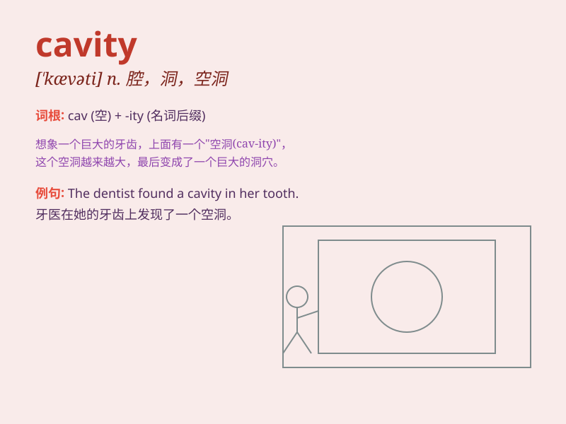

## cavity

**英音:** _[\'kævɪtɪ]_ **美音:** _[\'kævəti]_

**译义:** *n.洞,空穴,[解剖]腔*

### 短语

+ **oral cavity:** _口腔_

+ **nasal cavity:** _鼻腔_

+ **abdominal cavity:** _腹腔_

+ **thoracic cavity:** _胸腔_

+ **cavity wall:** _洞壁；腔壁_

### 例句

#### 例句1

> **The dentist found a cavity in my tooth.**

**中文翻译:** 牙医发现我的牙齿有个龋洞。

**单词释义:** 龋洞；腔

#### 例句2

> **The cavity in the tree was home to a family of squirrels.**

**中文翻译:** 树里的空洞是一窝松鼠的家。

**单词释义:** 洞；空穴

#### 例句3

> **The mold created a cavity in the concrete block.**

**中文翻译:** 模具在混凝土块上造成了一个凹坑。

**单词释义:** 凹处；凹槽

### 背诵小故事

> A brave explorer was in a dark cave. Suddenly, he fell into a deep
cavity. It was like a hidden trap. But he didn\'t panic and found a way
out. Remember, cavity is a hollow space.

**一位勇敢的探险家在一个黑暗的洞穴里。突然，他掉进了一个深深的洞腔。这就像一个隐藏的陷阱。但他没有惊慌，并找到了出路。记住，cavity
是洞；腔；凹处的意思。**

### 图义

