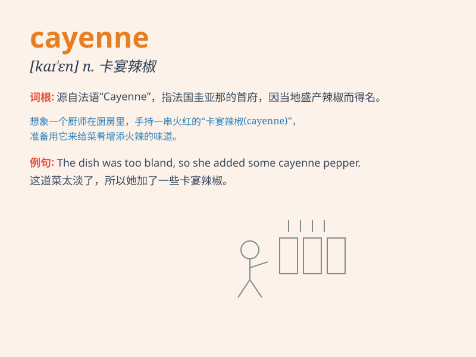

## cayenne

**英音:** _[keɪ\'en]_ **美音:** _[ke\'ɛn]_

**译义:** *n.辣椒*

### 短语

+ **cayenne pepper:** _辣椒；红辣椒_

+ **cayenne sauce:** _辣椒酱_

+ **cayenne extract:** _辣椒提取物_

+ **cayenne powder:** _辣椒粉_

+ **cayenne tree:** _辣椒树_

### 例句

#### 例句1

> **I added some cayenne pepper to the soup to give it a spicy
kick.**

**中文翻译:** 我往汤里加了一些卡宴辣椒粉，让它更辣一点。

**单词释义:** 卡宴辣椒粉

#### 例句2

> **The chef sprinkled cayenne on the steak for extra flavor.**

**中文翻译:** 厨师在牛排上撒了些卡宴辣椒来增添风味。

**单词释义:** 卡宴辣椒（粉）

#### 例句3

> **She couldn\'t handle the heat of the cayenne in the dish.**

**中文翻译:** 她受不了这道菜里卡宴辣椒的辣度。

**单词释义:** 卡宴辣椒

### 背诵小故事

> A brave adventurer was lost in a desert. Suddenly, he found a special
plant called cayenne. It was so spicy that it gave him the energy to
keep going and finally find his way out.

**一位勇敢的探险家在沙漠中迷路了。突然，他发现了一种特殊的植物叫卡宴辣椒。它非常辣，给了他继续前进的能量，最终找到了出路。**

### 图义

