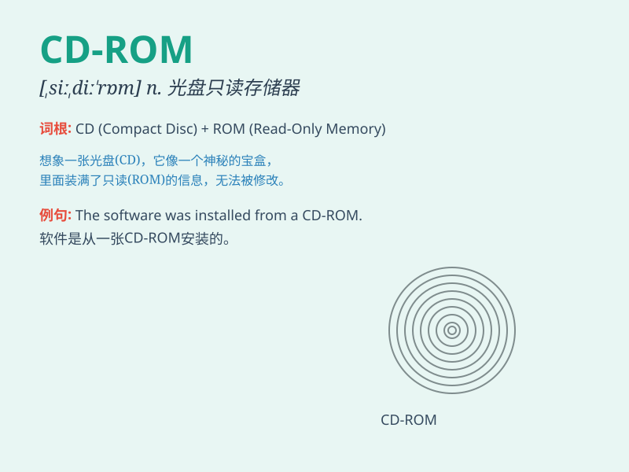

## CD-ROM

**英音:** _[ˈsiː.dɪː.rom]_ **美音:** _[ˈsiː.dɪː.rom]_

**译义:** *CD-ROM是一种存储介质，全称是Compact Disc Read-Only
Memory，即只读型光盘，用于存储数字数据，通常在计算机上使用*

### 短语

+ **CD-ROM drive:** _光盘驱动器_

+ **CD-ROM player:** _光盘播放机_

+ **install from CD-ROM:** _从光盘安装_

+ **copy files to CD-ROM:** _将文件复制到光盘_

+ **read data from CD-ROM:** _从光盘读取数据_

### 例句

#### 例句1

> **I inserted the CD-ROM into the computer to install the
software.**

**中文翻译:** 我把 CD-ROM 插入电脑以安装软件。

**单词释义:** 光盘只读存储器

#### 例句2

> **The CD-ROM contains a large amount of data and information.**

**中文翻译:** 这张 CD-ROM 包含大量的数据和信息。

**单词释义:** 光盘只读存储器

#### 例句3

> **Please give me the CD-ROM with the latest music albums.**

**中文翻译:** 请给我那张有最新音乐专辑的 CD-ROM。

**单词释义:** 光盘只读存储器

### 背诵小故事

> One day, I needed some important information stored on a CD-ROM. I
inserted it into the computer, and like a magic key, it opened the door
to knowledge. The CD-ROM was my trusty companion that held precious
data.

**有一天，我需要一些存储在 CD-ROM
里的重要信息。我把它插入电脑，它就像一把神奇的钥匙，打开了知识的大门。CD-ROM
是存有珍贵数据的可靠伙伴。**

### 图义

