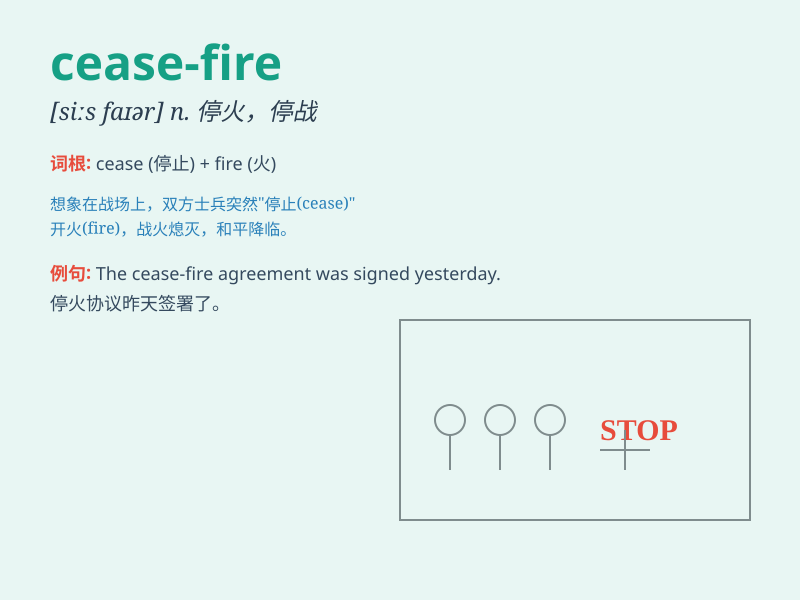

## cease-fire

**英音:** _[ˈsiːs.faiə(r)]_ **美音:** _[ˈsis.faɪr]_

**译义:** *n.停火，休战；停止攻击或战斗的状态*

### 短语

+ **declare a cease-fire:** _宣布停火_

+ **call for a cease-fire:** _呼吁停火_

+ **break the cease-fire:** _破坏停火_

+ **observe the cease-fire:** _遵守停火_

+ **negotiate a cease-fire:** _协商停火_

### 例句

#### 例句1

> **The two sides agreed to a cease-fire to end the long-standing
conflict.**

**中文翻译:** 双方同意停火以结束长期的冲突。

**单词释义:** 停火

#### 例句2

> **A cease-fire was declared, but tensions remained high in the
region.**

**中文翻译:** 宣布了停火，但该地区的紧张局势仍然很高。

**单词释义:** 停火

#### 例句3

> **The cease-fire allowed for the delivery of humanitarian aid to
the affected areas.**

**中文翻译:** 停火使得人道主义援助能够送达受影响的地区。

**单词释义:** 停火

### 背诵小故事

> In a war-torn land, the soldiers were exhausted. Finally, leaders on
both sides agreed to a cease-fire. They stopped shooting and let there
be peace. The cease-fire brought hope of an end to the endless conflict.

**在一片饱受战争蹂躏的土地上，士兵们都精疲力竭。最后，双方领导人同意停火。他们停止射击，带来了和平。这次停火给无尽的冲突带来了结束的希望。**

### 图义

