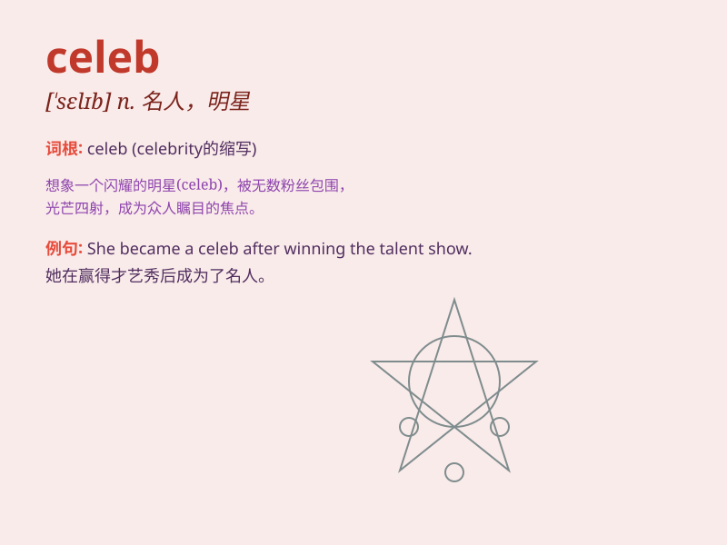

## celeb

**英音:** _[sɪ\'leb]_ **美音:** _[sə\'lɛb]_

**译义:** *n.\<俚>名人,著名人士,名流(celebrity的缩写)*

### 短语

+ **celeb gossip:** _名人八卦_

+ **celeb party:** _名人聚会_

+ **celeb interview:** _名人访谈_

+ **celeb fan:** _名人粉丝_

+ **celeb sighting:** _名人露面_

### 例句

#### 例句1

> **The celeb was mobbed by fans as she left the hotel.**

**中文翻译:** 这位名人离开酒店时被粉丝团团围住。

**单词释义:** 名人；名流

#### 例句2

> **He became a celeb overnight after his outstanding performance in
the movie.**

**中文翻译:** 他在这部电影中的出色表现让他一夜成名。

**单词释义:** 名人；明星

#### 例句3

> **The party was attended by many celebs from the entertainment
industry.**

**中文翻译:** 这个派对有许多来自娱乐圈的名人参加。

**单词释义:** 名人；知名人士

### 背诵小故事

> One day, I was walking in the street and saw a huge crowd. I pushed
through and found a celeb signing autographs. It was so exciting! Later
I realized that being a celeb means having many fans and attention.

**有一天，我走在街上，看到一大群人。我挤过去，发现一位名人在签名。太令人兴奋了！后来我意识到成为名人意味着有很多粉丝和关注。**

### 图义

