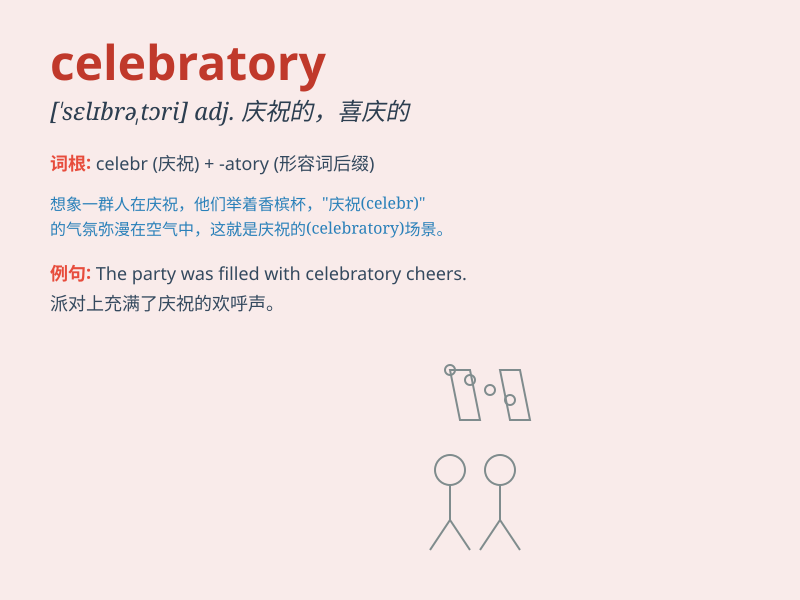

## celebratory

**英音:** _[ˈsɛlɪbreɪtəri]_ **美音:** _[ˈsɛlɪbreɪtɔri]_

**译义:** *adj.庆祝的，庆贺的；表示庆祝的*

### 短语

+ **celebratory party:** _庆祝派对_

+ **celebratory mood:** _庆祝的心情_

+ **celebratory event:** _庆祝活动_

+ **celebratory dinner:** _庆祝晚宴_

+ **celebratory speech:** _庆祝演讲_

### 例句

#### 例句1

> **The town held a celebratory parade to mark the anniversary.**

**中文翻译:** 这个城镇举行了一场庆祝游行来纪念周年纪念日。

**单词释义:** 庆祝的

#### 例句2

> **They had a celebratory dinner after winning the championship.**

**中文翻译:** 他们在赢得冠军后吃了一顿庆祝晚宴。

**单词释义:** 庆祝的

#### 例句3

> **The atmosphere was celebratory as the new year approached.**

**中文翻译:** 随着新年临近，气氛是庆祝性的。

**单词释义:** 庆祝性的

### 背诵小故事

> A group of friends decided to have a party. They decorated the room,
played music and danced. It was a celebratory event to mark one of their
achievements. They were all in a celebratory mood.

**一群朋友决定举办一个派对。他们装饰房间、播放音乐并跳舞。这是一个庆祝活动，以纪念他们的一项成就。他们都处于庆祝的心情中。**

### 图义

