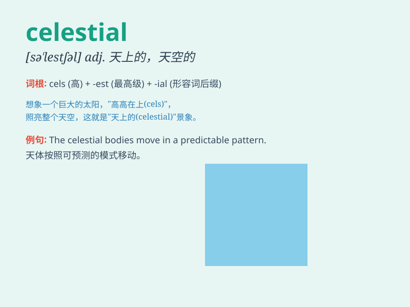

## celestial

**英音:** _[sɪ\'lestɪəl]_ **美音:** _[sə\'lɛstʃəl]_

**译义:** *adj.天上的*

### 短语

+ **celestial body:** _天体_

+ **celestial sphere:** _天球_

+ **celestial navigation:** _天文导航_

+ **celestial being:** _神仙；天人_

+ **celestial mechanics:** _天体力学_

### 例句

#### 例句1

> **The stars in the celestial sphere twinkle beautifully.**

**中文翻译:** 天空中的星星闪烁得很美。

**单词释义:** 天空的；天上的

#### 例句2

> **She believes in celestial beings and their powers.**

**中文翻译:** 她相信神灵及其力量。

**单词释义:** 神仙的；神的

#### 例句3

> **The astronomer studies celestial phenomena every day.**

**中文翻译:** 这位天文学家每天都研究天文现象。

**单词释义:** 天体的；天文的

### 背诵小故事

> A brave astronaut was on a mission in space. Looking out of the
window, he saw countless celestial bodies like stars and planets. They
were so beautiful and mysterious. \'Celestial\' means relating to the
sky or heaven.

**一位勇敢的宇航员正在执行太空任务。从窗口望去，他看到了无数像星星和行星这样的天体。它们如此美丽和神秘。'celestial'意思是与天空或天堂有关的。**

### 图义

