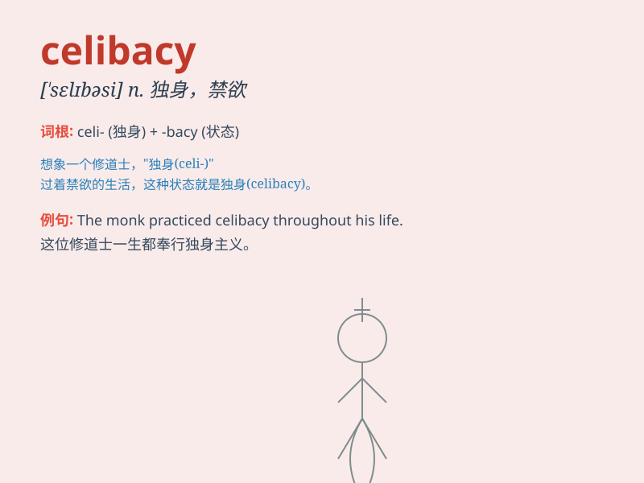

## celibacy

**英音:** _[\'selɪbəsɪ]_ **美音:** _[\'sɛləbəsi]_

**译义:** *n.独身生活*

### 短语

+ **remain in celibacy:** _保持独身_

+ **lead a life of celibacy:** _过独身生活_

+ **celibacy vow:** _独身誓言_

+ **practice celibacy:** _奉行独身_

+ **commit to celibacy:** _致力于独身_

### 例句

#### 例句1

> **He has chosen a life of celibacy and devotes himself to spiritual
pursuits.**

**中文翻译:** 他选择了独身生活，并全身心投入到精神追求中。

**单词释义:** 独身；禁欲

#### 例句2

> **The priest took a vow of celibacy before entering the clergy.**

**中文翻译:** 这位牧师在进入神职之前立下了独身的誓言。

**单词释义:** 独身（状态）

#### 例句3

> **Some people embrace celibacy for personal growth and
self-reflection.**

**中文翻译:** 一些人为了个人成长和自我反思而接受独身。

**单词释义:** 独身生活

### 背诵小故事

> A prince chose celibacy to focus on ruling his kingdom. He resisted
all romantic distractions and dedicated himself fully to his people.
Through this, he achieved great success.

**一位王子选择独身生活，以便专注于统治他的王国。他抵制了所有的浪漫诱惑，全身心地投入到他的子民身上。通过这样，他取得了巨大的成功。**

### 图义

