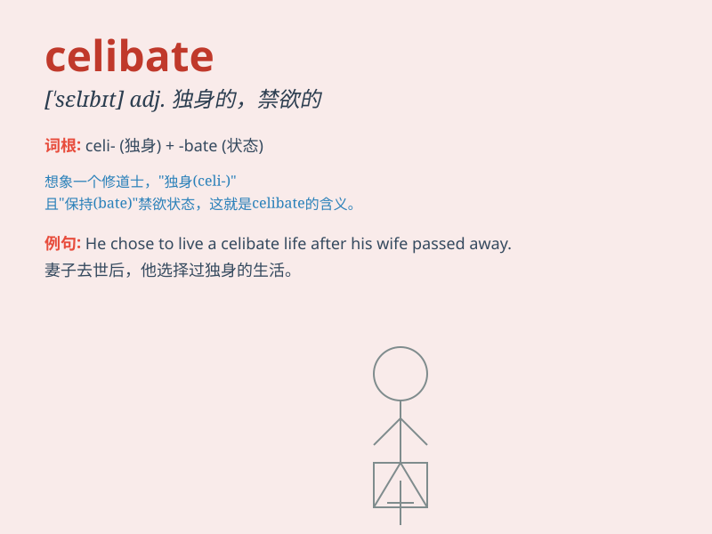

## celibate

**英音:** _[\'selɪbeɪt]_ **美音:** _[\'sɛlɪbət]_

**译义:** *n.独身者,独身主义者adj.独身的,未婚的,禁欲的*

### 短语

+ **lead a celibate life:** _过独身生活_

+ **remain celibate:** _保持独身_

+ **celibate vow:** _独身誓言_

+ **celibate priest:** _独身牧师_

+ **celibate state:** _独身状态_

### 例句

#### 例句1

> **He has chosen to remain celibate for religious reasons.**

**中文翻译:** 他因宗教原因选择保持独身。

**单词释义:** 独身的；禁欲的

#### 例句2

> **The priest is a celibate and devotes himself entirely to the
church.**

**中文翻译:** 这位牧师是独身的，全身心投入到教会中。

**单词释义:** 独身者

#### 例句3

> **She led a celibate life despite many suitors.**

**中文翻译:** 尽管有许多追求者，她还是过着独身生活。

**单词释义:** 独身的

### 背诵小故事

> A young man decided to be a celibate and focus on his art. He
resisted all romantic temptations. But one day, a charming girl
appeared. He struggled but remained celibate, finally achieving great
success in his art career.

**一个年轻人决定成为独身者并专注于他的艺术。他抵制了所有浪漫的诱惑。但有一天，一个迷人的女孩出现了。他挣扎但仍保持独身，最终在他的艺术生涯中取得了巨大的成功。**

### 图义

