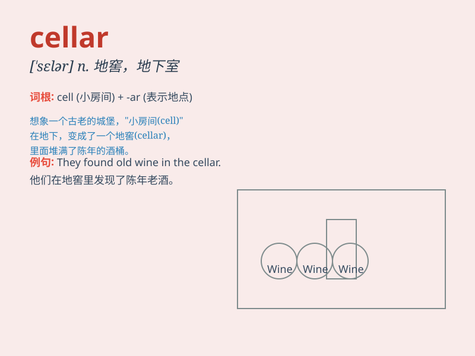

## cellar

**英音:** _[\'selə]_ **美音:** _[\'sɛlɚ]_

**译义:** *n.地窖,地下室,酒窖,藏酒量*

### 短语

+ **wine cellar:** _酒窖_

+ **cellar door:** _地下室的门_

+ **coal cellar:** _煤窖_

+ **root cellar:** _储藏根茎作物的地窖_

+ **cellar window:** _地下室窗户_

### 例句

#### 例句1

> **The wine is stored in the cellar.**

**中文翻译:** 葡萄酒被存放在地窖里。

**单词释义:** 地窖；地下室

#### 例句2

> **We found an old chest in the cellar.**

**中文翻译:** 我们在地下室里发现了一个旧箱子。

**单词释义:** 地下室

#### 例句3

> **The cellar was damp and dark.**

**中文翻译:** 这个地窖又潮又暗。

**单词释义:** 地窖

### 背诵小故事

> A brave mouse named Jerry lived in a dark cellar. It was full of old
wine bottles and mysterious corners. Jerry had many adventures there.
One day, he found a hidden treasure chest. The cellar became his secret
world.

**一只勇敢的老鼠杰瑞住在一个黑暗的地窖里。那里满是旧酒瓶和神秘的角落。杰瑞在那有许多冒险。有一天，他发现了一个隐藏的宝箱。这个地窖成了他的秘密世界。**

### 图义

