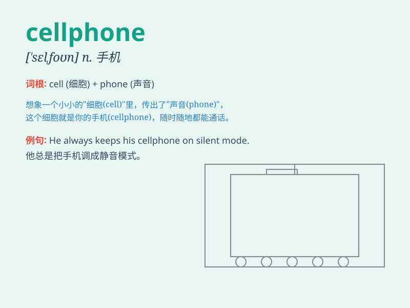

## cellphone

**英音:** _[ˈsel.foʊn]_ **美音:** _[ˈsɛl.foʊn]_

**译义:** *n. 手机，移动电话*

### 短语

+ **cellphone case:** _手机壳_

+ **cellphone charger:** _手机充电器_

+ **cellphone screen:** _手机屏幕_

+ **cellphone signal:** _手机信号_

+ **cellphone camera:** _手机摄像头_

### 例句

#### 例句1

> **I use my cellphone to call my friends every day.**

**中文翻译:** 我每天都用我的手机给朋友们打电话。

**单词释义:** 手机

#### 例句2

> **She lost her cellphone on the bus.**

**中文翻译:** 她在公交车上把手机弄丢了。

**单词释义:** 手机

#### 例句3

> **His cellphone has a great camera.**

**中文翻译:** 他的手机有一个很棒的摄像头。

**单词释义:** 手机

### 背诵小故事

> One day, I lost my cellphone. I was very worried and searched
everywhere. Finally, I found it in the pocket of my jacket. It made me
realize how important a cellphone is for communication.

**有一天，我弄丢了我的手机。我非常担心，到处找。最后，我在我夹克的口袋里找到了它。这让我意识到手机对于交流是多么重要。**

### 图义

