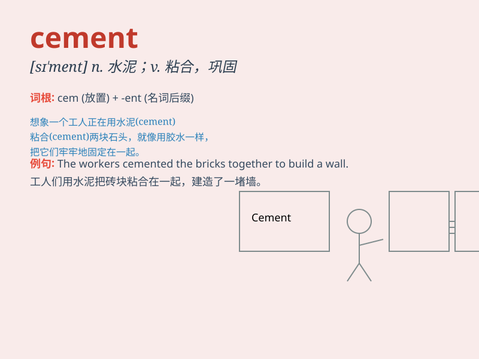

## cement

**英音:** _[sɪ\'ment]_ **美音:** _[sə\'mɛnt]_

**译义:** *n.水泥,接合剂vt.接合,用水泥涂,巩固vi.粘牢*

### 短语

+ **cement bond:** _水泥胶结_

+ **cement mortar:** _水泥砂浆_

+ **cement plant:** _水泥厂_

+ **cement concrete:** _水泥混凝土_

+ **portland cement:** _波特兰水泥；硅酸盐水泥_

### 例句

#### 例句1

> **The workers are using cement to build the foundation.**

**中文翻译:** 工人们正在用水泥建造地基。

**单词释义:** 水泥

#### 例句2

> **Their friendship was cemented by shared experiences.**

**中文翻译:** 他们的友谊因共同的经历而更加牢固。

**单词释义:** 巩固；加强

#### 例句3

> **The agreement cemented the partnership between the two
companies.**

**中文翻译:** 该协议巩固了两家公司之间的合作关系。

**单词释义:** 加强；巩固

### 背诵小故事

> A builder was in a hurry to finish a project. He needed cement to
hold the bricks together. Without cement, the building would collapse.
So, he made sure to have enough cement to make it strong and stable.

**一位建筑工人急于完成一个项目。他需要水泥将砖块粘在一起。没有水泥，建筑物就会倒塌。所以，他确保有足够的水泥使其坚固稳定。**

### 图义

