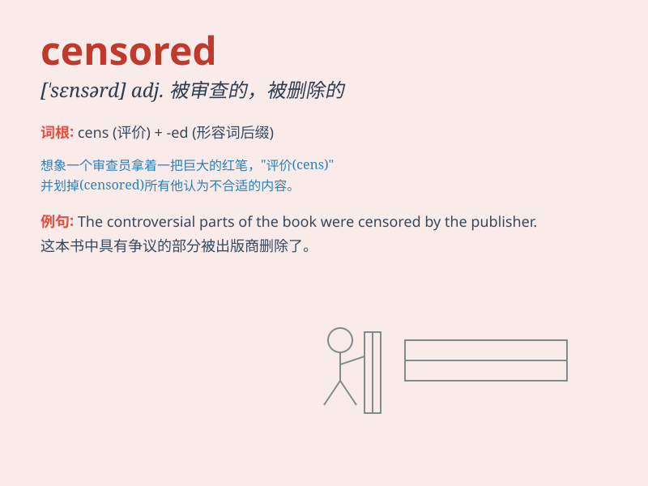

## censored

**英音:** _[ˈsɛnsəd]_ **美音:** _[ˈsɛnsərd]_

**译义:**
*adj.被审查的，被删除的；v.审查，删除（censor的过去分词）*

### 短语

+ **censored information:** _被审查的信息_

+ **censored material:** _被审查的材料_

+ **be censored:** _被审查_

+ **censored version:** _审查版_

+ **strictly censored:** _严格审查的_

### 例句

#### 例句1

> **The film was censored due to its violent content.**

**中文翻译:** 这部电影因其暴力内容而被审查。

**单词释义:** 审查；检查（出版物等）

#### 例句2

> **His speech was censored by the government.**

**中文翻译:** 他的演讲被政府审查了。

**单词释义:** 审查；检查

#### 例句3

> **The censored version of the book was released.**

**中文翻译:** 这本书的审查版发行了。

**单词释义:** 经过审查的

### 背诵小故事

> A journalist wrote a very critical article, but it was censored by
the government. They didn\'t want the public to know the truth. So,
\'censored\' means something is examined and parts are removed or
suppressed.

**一位记者写了一篇非常具有批判性的文章，但被政府审查了。他们不想让公众知道真相。所以，\'censored\'意思是某物被审查，部分内容被删除或压制。**

### 图义

