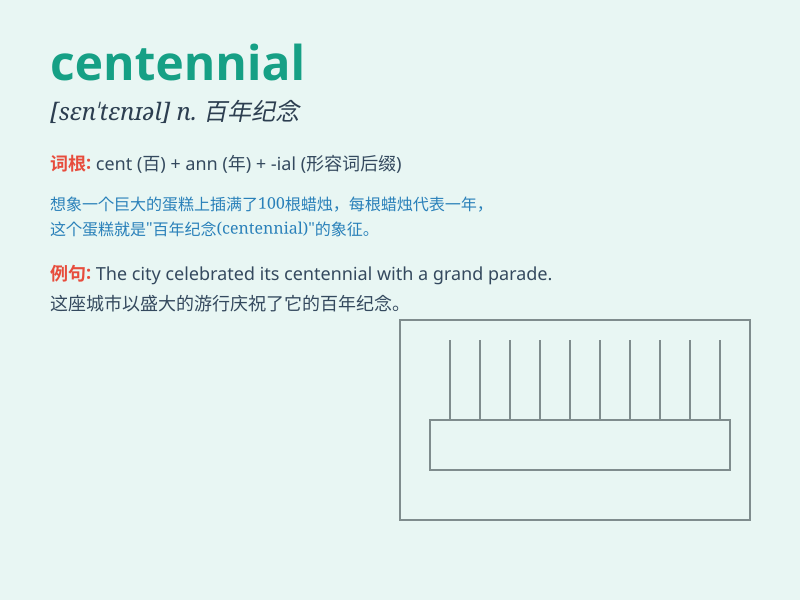

## centennial

**英音:** _[sen\'tenɪəl]_ **美音:** _[sɛn\'tɛnɪəl]_

**译义:** *n.百年纪念adj.一百年的*

### 短语

+ **centennial anniversary:** _百年纪念日_

+ **centennial celebration:** _百年庆典_

+ **centennial exhibition:** _百年展览_

+ **centennial history:** _百年历史_

+ **centennial monument:** _百年纪念碑_

### 例句

#### 例句1

> **The city is preparing for its centennial celebration.**

**中文翻译:** 这座城市正在为它的一百周年庆典做准备。

**单词释义:** 一百周年

#### 例句2

> **The centennial of the founding of the university was a grand
event.**

**中文翻译:** 这所大学的百年校庆是一件盛大的活动。

**单词释义:** 百年纪念

#### 例句3

> **The company published a special edition to mark its
centennial.**

**中文翻译:** 这家公司出版了一个特别版来纪念它的一百周年。

**单词释义:** 一百周年纪念

### 背诵小故事

> A little boy was excited for his town\'s centennial celebration. He
learned that \'centennial\' means a 100-year anniversary. He imagined
all the amazing things that happened in the town over 100 years.

**一个小男孩对他所在城镇的百年庆典感到兴奋。他了解到"centennial"意味着一百周年纪念日。他想象着这个城镇在
100 多年里发生的所有奇妙的事情。**

### 图义

