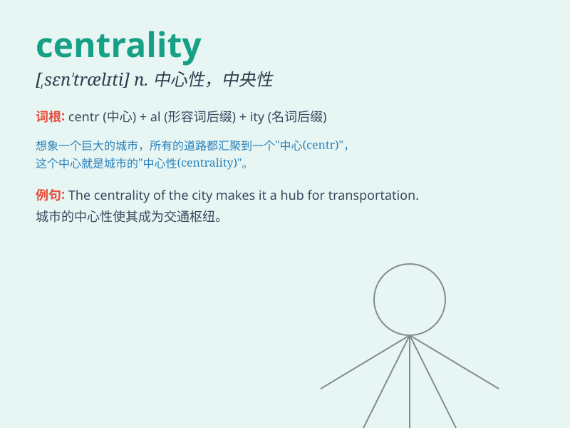

## centrality

**英音:** _[sen\'trælətɪ]_ **美音:** _[sɛn\'træləti]_

**译义:** *n.中心,中央,向心性,集中性*

### 短语

+ **spatial centrality:** _空间中心性_

+ **network centrality:** _网络中心性_

+ **centrality measure:** _中心性度量_

+ **degree centrality:** _度中心性_

+ **betweenness centrality:** _中间中心性_

### 例句

#### 例句1

> **The centrality of this issue cannot be overstated.**

**中文翻译:** 这个问题的重要性怎么强调都不为过。

**单词释义:** 重要性；中心地位

#### 例句2

> **The centrality of the city makes it a transportation hub.**

**中文翻译:** 这座城市的中心地位使其成为了交通枢纽。

**单词释义:** 中心地位

#### 例句3

> **The centrality of love in a relationship is crucial.**

**中文翻译:** 爱在一段关系中的核心地位至关重要。

**单词释义:** 核心地位

### 背诵小故事

> In a big city, there was a special building at the very center.
Everyone knew its importance. This building represented the
\'centrality\' of the city. It was the heart and core, where everything
important happened.

**在一个大城市里，正中心有一座特别的建筑。每个人都知道它的重要性。这座建筑代表了城市的"中心地位"。它是核心，所有重要的事情都在这里发生。**

### 图义

