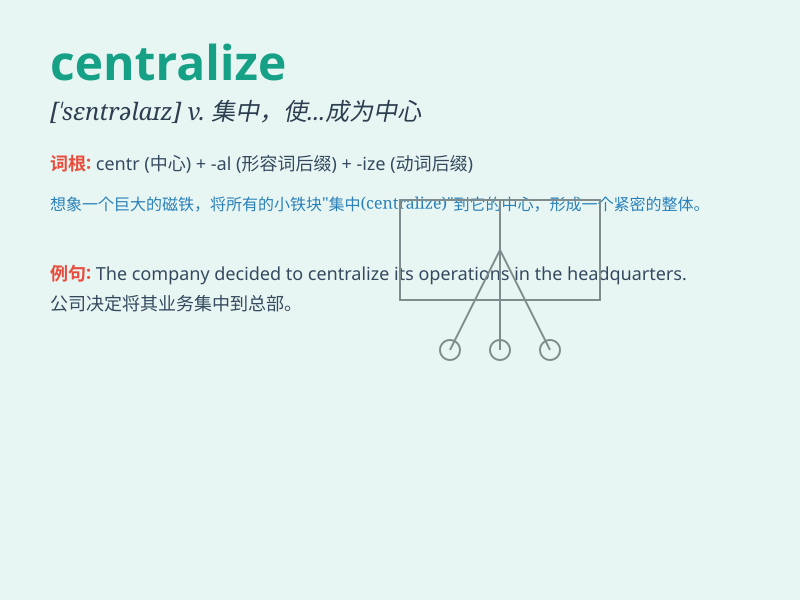

## centralize

**英音:** _[ˈsentrəlaɪz]_ **美音:** _[ˈsentrəlaɪz]_

**译义:** *vt.集聚,集中,施行中央集权vi.集中于中央(或中心)*

### 短语

+ **centralize power:** _集权_

+ **centralize control:** _集中控制_

+ **centralize management:** _集中管理_

+ **centralize resources:** _集中资源_

+ **centralize information:** _集中信息_

### 例句

#### 例句1

> **The company decided to centralize its management structure to
improve efficiency.**

**中文翻译:** 这家公司决定集中其管理结构以提高效率。

**单词释义:** 使集中

#### 例句2

> **The government is trying to centralize power in the hands of a
few.**

**中文翻译:** 政府正试图将权力集中在少数人手中。

**单词释义:** 集权

#### 例句3

> **We need to centralize the data storage to ensure better
security.**

**中文翻译:** 我们需要集中数据存储以确保更好的安全性。

**单词释义:** 集中

### 背诵小故事

> In a kingdom, the king wanted to centralize all power. He gathered
resources and decisions to one place, making the kingdom more unified.
But this also caused some problems. Remember, \'centralize\' means to
gather or bring to a center.

**在一个王国里，国王想要集权。他把资源和决策权都集中到一处，使王国更加统一。但这也引发了一些问题。记住，\'centralize\'意思是使集中**

### 图义

